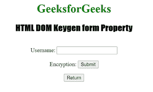

# HTML DOM Keygen 表单属性

> 原文:[https://www . geesforgeks . org/html-DOM-key gen-form-property/](https://www.geeksforgeeks.org/html-dom-keygen-form-property/)

HTML DOM 中的 **Keygen 表单属性**用于返回包含 Keygen 元素的表单的引用。它是只读属性，并在成功时返回表单对象。

**语法:**

```html
keygenObject.form
```

**返回值:**返回对包含按钮的表单元素的引用。如果密钥根不在表单中，它将返回空值。

**示例:**此示例显示了 Keygen 表单属性的工作方式。

## 超文本标记语言

```html
<!DOCTYPE html>
<html>

<head>
    <style>
        h1 {
            color: green;
        }

        h2 {
            font-family: Impact;
        }

        body {
            text-align: center;
        }
    </style>
</head>

<body>
    <h1>GeeksforGeeks</h1>

    <h2>HTML DOM Keygen form Property</h2>
    <br>

    <form id="myGeeks">
        Username:
        <input type="text" name="uname">
        <br><br> Encryption:
        <keygen id="Geeks" form="myGeeks" 
            name="secure" autofocus>
        <input type="submit">
    </form>

    <button onclick="My_form()">
        Return
    </button>

    <p id="test"></p>

    <script>
        function My_form() {
            var d = document.getElementById("Geeks").form.id;
            document.getElementById("test").innerHTML = d;
        }
    </script>
</body>

</html>
```

**输出:**



**支持的浏览器:**

*   谷歌 Chrome
*   歌剧
*   火狐浏览器
*   苹果 Safari