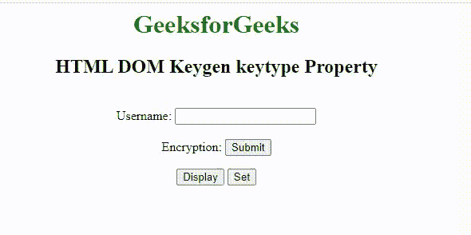

# HTML DOM Keygen keytype 属性

> 原文:[https://www . geesforgeks . org/html-DOM-key gen-key type-property/](https://www.geeksforgeeks.org/html-dom-keygen-keytype-property/)

HTML DOM 中的**HTML**[**key gen**](https://www.geeksforgeeks.org/html-keygen-tag/)*****key type*****属性用于设置或返回 **keygen** 元素的 *keytype* 属性的值。*键类型*属性用于定义将要使用的键的类型。****

******语法:******

****它返回一个 keytype 属性。****

```html
**keygenObject.keytype**
```

****它用于设置 keytype 属性。****

```html
**keygenObject.keytype = "rsa|dsa|ec"**
```

******属性值:******

*   ******rsa:** 为默认值。它定义了一个 RSA 安全算法。它为用户提供了 RSA 关键优势的选择。****
*   ******dsa:** 定义了 dsa 安全算法。它为用户提供了 DSA 密钥大小的选择。****
*   ******ec:** 定义了一个 ec 安全算法。它为用户提供了电子商务关键优势的选择。****

******返回值:**它返回一个字符串值，代表所使用的键的类型。****

******示例:**本示例设置并返回*键类型*属性。****

## ****超文本标记语言****

```html
**<!DOCTYPE html>
<html>

<head>
    <style>
        h1 {
            color: green;
        }

        body {
            text-align: center;
        }
    </style>
</head>

<body>
    <h1>GeeksforGeeks</h1>
    <h2>HTML DOM Keygen keytype Property</h2>
    <br>

    <form id="formID">
        Username: <input type="text" name="uname">
        <br><br> Encryption:
        <keygen id="keygenID" form="formID" 
            name="secure" keytype="rsa" autofocus>
        <input type="submit">
    </form>

    <button onclick="display()">Display</button>
    <button onclick="set_name()">Set</button>

    <p id="test"></p>

    <script>
        function display() {
            var d = document.getElementById("keygenID").keytype;
            alert(
                "The value of the keytype is !" + d
            );
        }
        function set_name() {
            var g = document.getElementById("keygenID")
                    .keytype = "dsa";

            alert(
                "The  value of the Keytype "
                + "attribute was changed to " + g
            );
        }
    </script>
</body>

</html>**
```

******输出:******

********

******支持的浏览器:******

*   ****谷歌 Chrome****
*   ****火狐浏览器****
*   ****旅行队****
*   ****歌剧****