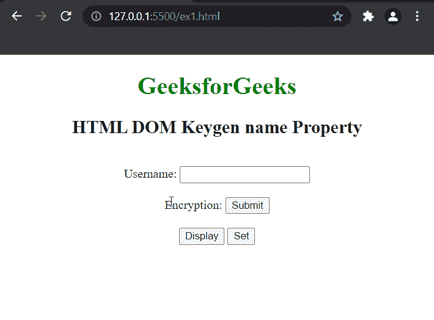

# HTML DOM Keygen 名称属性

> 原文:[https://www . geesforgeks . org/html-DOM-key gen-name-property/](https://www.geeksforgeeks.org/html-dom-keygen-name-property/)

HTML DOM 中的 **keygen 名称属性**用于设置或返回< keygen >元素的名称属性的值。name 属性用于指定 keygen 元素的名称。

**语法:**

*   它返回*名称*属性。

    ```html
    keygenObject.name
    ```

*   设置*名称*属性。

    ```html
    keygenObject.name = keygenName
    ```

**返回值:**它返回一个代表 keygen 元素名称的字符串值。

**属性值:**它包含一个字符串值，用于指定 keygen 元素的名称。

**示例:**下面的 HTML 代码返回并设置 keygen 元素的名称。

## 超文本标记语言

```html
<!DOCTYPE html>
<html>

<head>
    <style>
        h1 {
            color: green;
        }

        body {
            text-align: center;
        }
    </style>
</head>

<body>
    <h1>GeeksforGeeks</h1>

    <h2>HTML DOM Keygen name Property</h2>
    <br>

    <form id="myGeeks">
        Username: <input type="text" 
                         name="uname">
        <br><br> Encryption:
        <keygen id="Geeks" form="myGeeks"
                name="secure" autofocus>
        <input type="submit">
    </form>
    <br>
    <button onclick="display()">Display</button>
    <button onclick="set_name()">Set</button>

    <p id="test"></p>

    <script>
        function display() {
            var d = document.getElementById("Geeks").name;
            alert(
              "The name of the keygen is: " + d);
        }

        function set_name() {
            var g = document.getElementById(
                "Geeks").name = "myKeygen";

            alert(
                "The name of the Keygen was changed to " + g
            );
        }
    </script>
</body>

</html>
```

**输出:**



**支持的浏览器:**

*   谷歌 Chrome
*   歌剧
*   旅行队
*   火狐浏览器