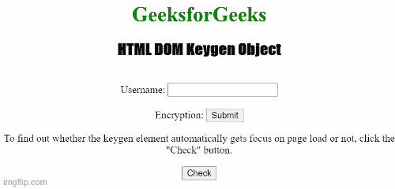
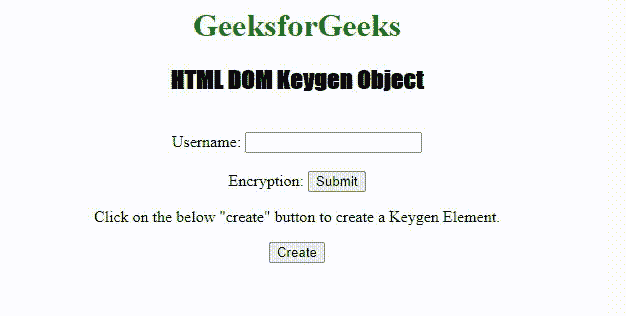

# html DOM keygen 对象

> 原文:[https://www.geeksforgeeks.org/html-dom-keygen-object/](https://www.geeksforgeeks.org/html-dom-keygen-object/)

HTML DOM keygen 对象用来表示 [< keygen >](https://www.geeksforgeeks.org/html-keygen-tag/) 元素。将使用 HTML DOM[**document . createelement()**](https://www.geeksforgeeks.org/html-dom-createelement-method/)方法创建< keygen >元素，并通过[***getElementById()***进行访问。](https://www.geeksforgeeks.org/how-getelementbyid-works-in-javascript/)html 5 中新增。

**语法:**

```html
document.getElementById("ID">);
```

**属性值**

*   [**【自动对焦】**](https://www.geeksforgeeks.org/html-dom-keygen-autofocus-property/?ref=rp) **:** 用于页面加载时设置或返回 keygen 元素是否对焦。
*   **挑战:**用于设置或返回某个 keygen 元素的挑战属性的值。
*   [**禁用**](https://www.geeksforgeeks.org/html-dom-keygen-disabled-property/?ref=rp) **:用于设置或返回 keygen 元素是否禁用。**
*   [**表单:** I](https://www.geeksforgeeks.org/html-dom-keygen-form-property/?ref=rp) t 返回包含 keygen 元素的表单的引用。
*   [**keytype:** 它](https://www.geeksforgeeks.org/html-dom-keygen-keytype-property/?ref=rp)用于设置或返回 keygen 元素的 keytype 属性的值。
*   [**名称:**](https://www.geeksforgeeks.org/html-dom-keygen-name-property/?ref=rp) 用于设置或返回 keygen 元素的名称属性的值。
*   [**类型:**](https://www.geeksforgeeks.org/html-dom-keygen-type-property/?ref=rp) 它返回一个 keygen 字段的表单元素类型。

**示例 1:** 以下示例演示如何访问**<>**元素。

## 超文本标记语言

```html
<!DOCTYPE html>
<html>

<head>
    <style>
        h1 {
            color: green;
        }

        h2 {
            font-family: Impact;
        }

        body {
            text-align: center;
        }
    </style>
</head>

<body>
    <h1>GeeksforGeeks</h1>

    <h2>HTML DOM Keygen Object</h2>
    <br>

    <form id="myGeeks">
        Username: <input type="text" name="uname">
        <br><br> Encryption:
        <keygen id="Geeks" form="myGeeks"
                name="secure" autofocus>
        <input type="submit">
    </form>

<p>
        To find out whether the keygen element
        automatically gets focus on page load or
        not, click the "Check" button.
    </p>

    <button onclick="My_focus()">Check</button>

    <p id="test"></p>

    <script>
        function My_focus() {
            var d = document.getElementById("Geeks").autofocus;
            document.getElementById("test").innerHTML = d;
        }
    </script>
</body>

</html>
```

**输出:**



**创建密钥生成对象:**

```html
document.createElement()
```

**例 2:**

## 超文本标记语言

```html
<!DOCTYPE html>
<html>

<head>
    <style>
        h1 {
            color: green;
        }

        h2 {
            font-family: Impact;
        }

        body {
            text-align: center;
        }
    </style>
</head>

<body>
    <h1>GeeksforGeeks</h1>

    <h2>HTML DOM Keygen Object</h2>
    <br>

    <form id="myGeeks">
        Username: <input type="text" name="uname">
        <br><br> Encryption:
        <input type="submit">
    </form>

<p>
        Click on the below "create" button
        to create a Keygen Element.
    </p>

    <button onclick="create()">Create</button>

    <p id="test"></p>

    <script>
        function create() {
            var x = document.createElement("KEYGEN");
            x.setAttribute("name", "security");
            document.body.appendChild(x);
            alert("A kEYGEN element is created");
        }
    </script>
</body>

</html>
```

**输出:**



**支持的浏览器:**

*   谷歌 Chrome
*   歌剧
*   不支持 Internet Explorer
*   火狐浏览器
*   苹果 Safari