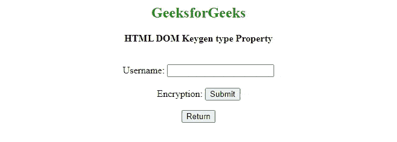

# HTML DOM Keygen 类型属性

> 原文:[https://www . geesforgeks . org/html-DOM-key gen-type-property/](https://www.geeksforgeeks.org/html-dom-keygen-type-property/)

**HTML DOM Keygen** ***类型*** 属性用于设置或返回包含 Keygen 字段的表单元素的类型。该属性将始终返回“keygen”。

**语法:**

返回 keygen 类型属性。

```html
 keygenObject.type
```

**返回值:**返回一个字符串值，代表表单元素的 keygen 字段的类型。

**示例:**下面的程序说明了[键根](https://www.geeksforgeeks.org/html-keygen-tag/) *类型*属性的使用。

## 超文本标记语言

```html
<!DOCTYPE html>
<html>

<head>
    <style>
        h2 {
            color: green;
        }

        body {
            text-align: center;
        }
    </style>
</head>

<body>
    <h2>GeeksforGeeks</h2>
    <p><b>HTML DOM Keygen type Property</b></p>
    <br>

    <form id="formID">
        Username:
        <input type="text" name="uname">
        <br><br> Encryption:
        <keygen id="keyid" form="formID" 
            name="secure" autofocus>
        <input type="submit">
    </form>

    <button onclick="My_form()">
        Return
    </button>

    <p id="test"></p>

    <script>
        function My_form() {
            var d = document.getElementById("keyid").type;
            document.getElementById("test").innerHTML = d;
        }
    </script>
</body>

</html>
```

**输出:**



**支持的浏览器:**

*   谷歌 Chrome
*   不支持 Internet Explorer
*   歌剧
*   火狐浏览器
*   苹果 Safari