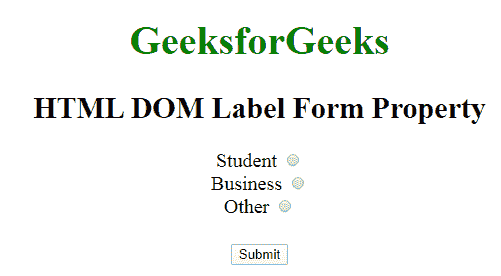
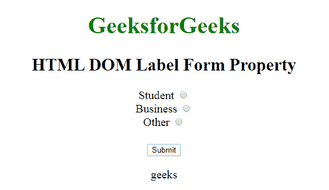

# HTML | DOM 标签表单属性

> 原文:[https://www.geeksforgeeks.org/html-dom-label-form-property/](https://www.geeksforgeeks.org/html-dom-label-form-property/)

**HTML DOM 标签表单属性**用于返回对包含标签元素的表单的引用。成功时返回表单对象的是只读属性。

**语法:**

```html
labelObject.form
```

**返回值:**返回包含标签的引用，如果标签不在表单中，则返回*空值*返回表单。

**示例:**

```html
<!DOCTYPE html> 
<html>

<head>
    <title>DOM Label Form Property</title>

    <style>
        body {
            font-size: 20px;
        }
    </style>
</head>

<body style="text-align:center">

    <h1 style="color:green">GeeksforGeeks</h1>
    <h2> HTML DOM Label Form Property</h2>

    <form id="geeks">

        <!-- Starts label tag from here -->
        <label id="sudo" for="student">
            Student
        </label>
        <input type="radio" 
               name="Occupation"
               id="student" 
               value="student">
        <br>

        <label for="business">
            Business
        </label>
        <input type="radio" 
               name="Occupation" 
               id="business"
               value="business">
        <br>

        <label for="other">
            Other
        </label>
        <!-- Ends label tags here -->

        <input type="radio"
               name="Occupation" 
               id="other" 
               value="other">
    </form>
    <br>
    <button onclick="myGeeks()">Submit</button>
    <p id="gfg"></p>
    <script>
        function myGeeks() {
            var g = document.getElementById("sudo").form.id;
            document.getElementById("gfg").innerHTML = g;
        }
    </script>
</body>

</html>
```

**输出:**
**点击按钮前:**

**点击按钮后:**


**支持的浏览器:****DOM 标签表单属性**支持的浏览器如下:

*   谷歌 Chrome
*   微软公司出品的 web 浏览器
*   火狐浏览器
*   苹果 Safari
*   歌剧