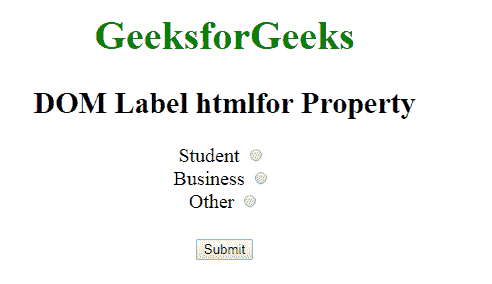
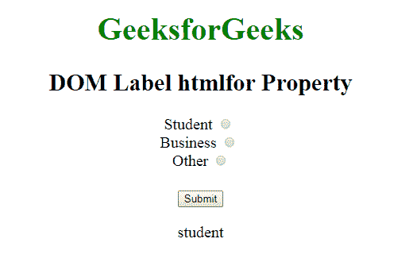
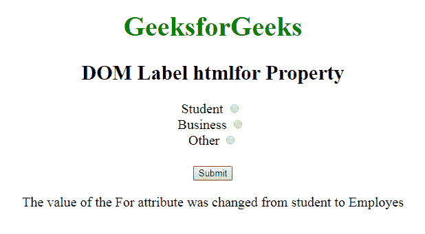

# HTML | DOM 标签 htmlFor Property

> 原文:[https://www . geesforgeks . org/html-DOM-label-html for-property/](https://www.geeksforgeeks.org/html-dom-label-htmlfor-property/)

**DOM 标签 htmlFor Property** 用于**设置**或**返回**标签<元素的 For 属性的值。“用于”属性定义将标记哪个表单元素。

**语法:**

*   用于返回 htmlFor 属性:

    ```html
    labelObject.htmlFor
    ```

*   用于设置 htmlFor 属性:

    ```html
    labelObject.htmlFor = id
    ```

**属性值:**

*   **id:** 定义了应该标注的元素的 id 属性。

**返回值:**返回一个字符串值，代表将要被标记的元素的 id。

**示例-1:** 说明如何返回属性的 HTML 程序。

```html
<!DOCTYPE html>
<html>

<head>
    <title>DOM Label htmlFor Property
  </title>

    <style>
        body {
            font-size: 20px;
        }
    </style>
</head>

<body style="text-align:center">

    <h1 style="color:green">GeeksforGeeks
  </h1>
    <h2>DOM Label htmlfor Property</h2>

    <form>

        <!-- Starts label tag from here -->
        <label for="student" 
               id="GFG">
            Student
        </label>
        <input type="radio" 
               name="Occupation" 
               id="student" 
               value="student">
        <br>

        <label for="business">
            Business
        </label>
        <input type="radio" 
               name="Occupation" 
               id="business"
               value="business">
        <br>

        <label for="other">
            Other
        </label>
        <!-- Ends label tags here -->

        <input type="radio" 
               name="Occupation" 
               id="other" 
               value="other">
    </form>
    <br>
    <button onclick="myGeeks()">Submit
  </button>

    <p id="sudo"></p>
    <script>
        function myGeeks() {

            // Return htmlfor property.
            var g = 
            document.getElementById("GFG").htmlFor;
            document.getElementById("sudo").innerHTML = 
              g;
        }
    </script>
</body>

</html>
```

**输出:**

**点击按钮前:**


**点击按钮后:**


**示例-2:** 说明如何设置 htmlFor 属性的 HTML 程序。

```html
<!DOCTYPE html>
<html>

<head>
    <title>DOM Label htmlFor Property
  </title>

    <style>
        body {
            font-size: 20px;
        }
    </style>
</head>

<body style="text-align:center">

    <h1 style="color:green">GeeksforGeeks
  </h1>

    <h2>DOM Label htmlfor Property</h2>

    <form>

        <!-- Starts label tag from here -->
        <label for="student" 
               id="GFG">
            Student
        </label>
        <input type="radio" 
               name="Occupation" 
               id="student" 
               value="student">
        <br>

        <label for="business">
            Business
        </label>
        <input type="radio"
               name="Occupation" 
               id="business" 
               value="business">
        <br>

        <label for="other">
            Other
        </label>
        <!-- Ends label tags here -->

        <input type="radio" 
               name="Occupation"
               id="other"
               value="other">
    </form>
    <br>
    <button onclick="myGeeks()">Submit
  </button>

    <p id="sudo"></p>
    <script>
        function myGeeks() {

            // Set htmlfor property.
            var g = 
           document.getElementById("GFG").htmlFor = 
                "Employes"
            document.getElementById("sudo").innerHTML = 
          "The value of the For attribute was "
            "changed from student to " + g;
        }
    </script>
</body>

</html>
```

**输出:**

**点击按钮前:**


**点击按钮后:**


**支持的浏览器:****DOM Label html for Property**支持的浏览器如下:

*   谷歌 Chrome
*   微软公司出品的 web 浏览器
*   火狐浏览器
*   歌剧
*   旅行队