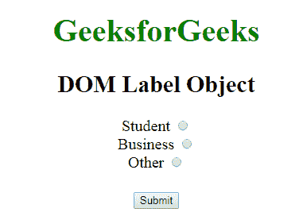
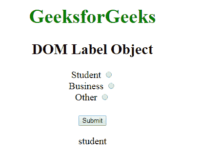
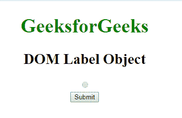
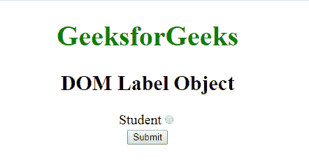

# HTML | DOM 标签对象

> 原文:[https://www.geeksforgeeks.org/html-dom-label-object/](https://www.geeksforgeeks.org/html-dom-label-object/)

**DOM 标签对象**用于表示 [<标签>](https://www.geeksforgeeks.org/html-label-tag/) 元素。标签元素由 **getElementById()** 访问。
**属性:**

*   **控制:**用于返回标记的控制。
*   [**表单:**](https://www.geeksforgeeks.org/html-dom-label-form-property/?ref=rp) 用于返回包含标签的表单的地址。
*   [](https://www.geeksforgeeks.org/html-dom-label-htmlfor-property/?ref=rp)****:**用于设置或返回标签的 For 属性的值。**

****语法:**** 

```html
document.getElementById("ID");
```

**其中**“id”**是分配给**“标签”**标签的 ID。
**例-1:**** 

## **超文本标记语言**

```html
<!DOCTYPE html>
<html>

<head>
    <title>DOM Label Object</title>

    <style>
        body {
            font-size: 20px;
        }
    </style>
</head>

<body style="text-align:center">

    <h1 style="color:green">GeeksforGeeks</h1>
    <h2>DOM Label Object</h2>

    <form>

        <!-- Starts label tag from here -->
        <label for="student" id="GFG">
            Student
        </label>
        <input type="radio"
          name="Occupation"
          id="student"
          value="student">
        <br>

        <label for="business">
            Business
        </label>
        <input type="radio"
         name="Occupation"
         id="business"
         value="business">
        <br>

        <label for="other">
            Other
        </label>
        <!-- Ends label tags here -->

        <input type="radio"
         name="Occupation"
         id="other"
         value="other">
    </form>
    <br>
    <button onclick="myGeeks()">Submit</button>
    <p id="sudo"></p>

    <script>
        function myGeeks() {
            var g = document.getElementById("GFG").htmlFor;
            document.getElementById("sudo").innerHTML = g;
        }
    </script>
</body>

</html>
```

****输出:**
**点击按钮前:**** 

****

****点击按钮后:**** 

****

****示例-2:** 可以使用**文档.创建元素**方法创建标签对象。** 

## **超文本标记语言**

```html
<!DOCTYPE html>
<html>

<head>
    <title>DOM Label Object</title>

    <style>
        body {
            font-size: 20px;
        }
    </style>
</head>

<body style="text-align:center;">

    <h1 style="color:green">GeeksforGeeks</h1>
    <h2>DOM Label Object</h2>

    <form id="GFG">
        <input type="radio"
         name="Occupation"
         id="Student"
         value="student">
    </form>
    <button onclick="myGeeks()">Submit</button>
    <script>
        function myGeeks() {
            var g = document.createElement("LABEL");
            var f = document.createTextNode("Student");
            g.setAttribute("for", "Student");
            g.appendChild(f);
            document.getElementById("GFG").insertBefore(
              g, document.getElementById("Student"));
        }
    </script>
</body>

</html>               
```

****输出:**
**点击按钮前:**** 

****

****点击按钮后:**** 

****

****支持的浏览器:****DOM 标签对象**支持的浏览器如下:** 

*   **谷歌 Chrome**
*   **微软公司出品的 web 浏览器**
*   **火狐浏览器**
*   **歌剧**
*   **旅行队**