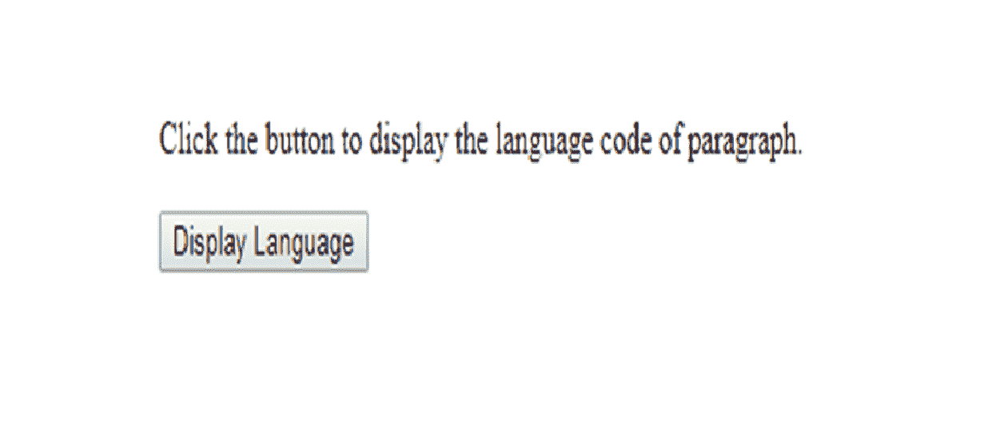

# HTML | DOM lang 属性

> 原文:[https://www.geeksforgeeks.org/html-dom-lang-property/](https://www.geeksforgeeks.org/html-dom-lang-property/)

在 HTML 文档中， **lang 属性**用于设置或返回元素 lang 属性的值。此属性指定元素内容的语言代码。元素属性取英语的“en”，日语的“ja”，西班牙语的“es”等等。此属性的默认值未知。
**语法:**
**获取郎的值:**

```html
HTMLElementObject.lang;
```

**为郎设置新值:**

```html
HTMLElementObject.lang = language_code;
```

**属性值:****语言代码**指定元素内容的语言代码。此属性返回一个表示元素文本语言的字符串。
**返回值:**一个字符串，代表元素文本的语言

**例-1:** 赋值语言代码的值。

## 超文本标记语言

```html
<!DOCTYPE html>
<html>

<head>
    <title>
        HTML | DOM lang Property
    </title>
</head>

<body>

    <p id="para1" lang="en">
        Click the button to display
      the language code of paragraph.
    </p>

    <button onclick="myFunction()">
        Display Language
    </button>

    <p id="para2"></p>

    <script>
        function myFunction() {
            var x = document.getElementById("para1").lang;
            document.getElementById("para2").innerHTML = x;
        }
    </script>

</body>

</html>
```

**输出:**
**点击按钮前:**



**点击显示语言按钮后:**


**解释:**
上例获取第一段的语言代码，并将该语言赋给第二段。
**例-2:** 检查语言代码的值。

## 超文本标记语言

```html
<!DOCTYPE html>
<html>

<head>
    <title>
        HTML | DOM lang Property
    </title>
</head>

<body>

    <p id="para1" lang="ja">
        Click the button to display
      the language code of paragraph.
    </p>

    <button onclick="myFunction()">
        Display Language
    </button>

    <p id="para2"></p>

    <script>
        function myFunction() {
            if (document.getElementById("para1").lang === "ja") {
                document.getElementById("para2").innerHTML =
                    "Japanese";
            } else {
                document.getElementById("demo").innerHTML =
                    "Not in Japanese";
            }
        }
    </script>

</body>

</html>
```

**输出:**
**点击**
按钮前


**点击显示语言按钮**后


**支持的浏览器:**

*   谷歌 Chrome
*   微软公司出品的 web 浏览器
*   火狐浏览器
*   歌剧
*   旅行队