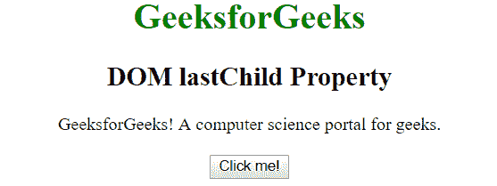
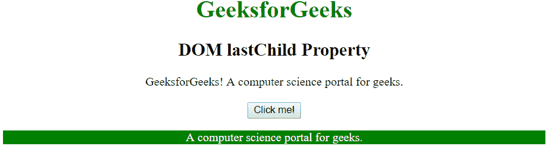
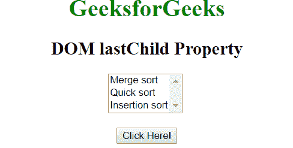
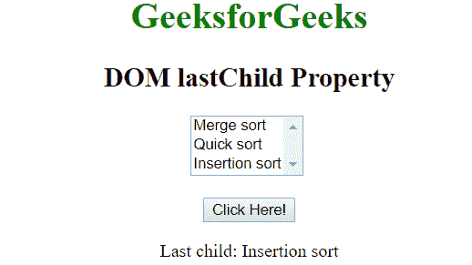

# HTML | DOM lastChild 属性

> 原文:[https://www.geeksforgeeks.org/html-dom-lastchild-property/](https://www.geeksforgeeks.org/html-dom-lastchild-property/)

**DOM lastChild 属性**用于返回指定节点的最后一个子节点。它以文本、注释或元素节点的形式返回最后的子节点(取决于最后出现的是哪一个)。它是只读属性。

**语法:**

```html
node.lastChild
```

**返回值:**返回一个节点对象，表示该节点的最后一个子节点，如果没有子元素，则返回 null。

**例 1:**

```html
<!DOCTYPE html>
<html>
    <head>
        <title>
            DOM lastChild Property
        </title>

        <script>
            function geek() {
                var doc = 
                document.getElementById("div").lastChild.innerHTML;

                document.getElementById("p").innerHTML = doc;
                document.getElementById("p").style.color = "white";
                document.getElementById("p").style.background = "green";
            }
        </script>
    </head>

    <body style = "text-align: center;">

        <h1 style = "color:green;">
            GeeksforGeeks
        </h1>

        <h2>
            DOM lastChild Property
        </h2>

        <div id = "div">
        <span>GeeksforGeeks! </span>
        <span>
            A computer science portal for geeks.
        </span></div>
        <br>
        <button onclick="geek()">Click me!</button>

        <p id="p"></p>
    </body>
</html>                    
```

**输出:**
**之前点击按钮:**

**之后点击按钮:**


**例 2:**

```html
<!DOCTYPE html>
<html>
    <head>
        <title>
            HTML DOM lastChild Property
        </title>

        <script>
            function Geeks() {
                var x = 
                document.getElementById("sel").lastChild.text;

                document.getElementById("p").innerHTML 
                        = "Last child: " + x;
            }
        </script>
    </head>

    <body style = "text-align: center;">

        <h1 style = "color:green;">
            GeeksforGeeks
        </h1>

        <h2>
            DOM lastChild Property
        </h2>

        <select id = "sel" size = "3">
            <option>Merge sort</option>
            <option>Quick sort</option>
            <option>Insertion sort</option></select>
        <br><br>

        <button onclick = "Geeks()">
            Click Here!
        </button>

        <p id="p"></p>
    </body>
</html>                    
```

**输出:**
**点击按钮前:**

**点击按钮后:**

**支持的浏览器:**last child 属性支持的浏览器如下:

*   谷歌 Chrome
*   微软公司出品的 web 浏览器
*   火狐浏览器
*   歌剧
*   旅行队