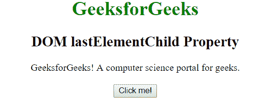
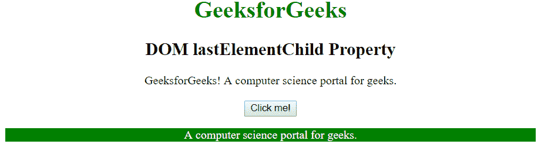

# HTML | DOM 负载元素子属性

> 原文:[https://www . geesforgeks . org/html-DOM-lasteelementchild-property/](https://www.geeksforgeeks.org/html-dom-lastelementchild-property/)

**DOM lastElementChild 属性**用于返回指定元素的最后一个子元素，如果没有最后一个元素，则返回 null。它类似于 lastChild 属性，但不同之处在于 lastChild 属性返回所有的最后一个子节点，即它也包括文本和注释节点，但另一方面 *lastElementChild* 只返回最后一个节点作为元素节点。它是只读属性。

**语法:**

```html
element.lastElementChild
```

**返回值:**返回一个代表元素最后一个子元素的对象。如果没有子元素，则返回 null。

**示例:**

```html
<!DOCTYPE html>
<html>

<head>
    <title>
        DOM lastElementChild Property
    </title>

    <!-- script to find last child element -->
    <script>
        function Geeks() {
            var doc =
                document.getElementById("GFG").lastElementChild.innerHTML;
                document.getElementById("p").innerHTML = doc;
                document.getElementById("p").style.color = "white";
                document.getElementById("p").style.background = "green";
        }
    </script>
</head>

<body style="text-align: center;">

    <h1 style="color:green;">
            GeeksforGeeks
        </h1>

    <h2>
            DOM lastElementChild Property
        </h2>

    <div id="GFG">
        <span>GeeksforGeeks!</span>
        <span>A computer science portal for geeks.</span>
    </div>

    <br>
    <button onclick="Geeks()">
        Click me!
    </button>

    <p id="p"></p>
</body>

</html>    
```

**输出:**
**之前点击按钮:**

**之后点击按钮:**


**支持的浏览器:**DOM lasteelementchild 属性支持的浏览器如下:

*   谷歌 Chrome 2.0
*   Internet Explorer 9.0
*   Firefox 3.5
*   opera10.0
*   Safari 4.0