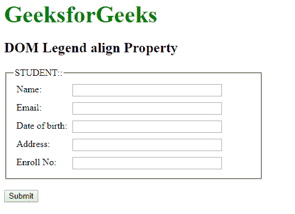
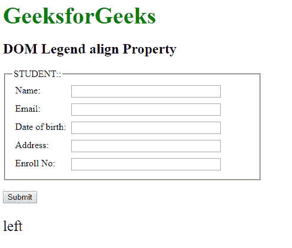
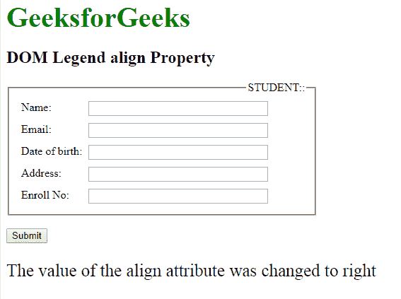

# HTML | DOM 图例对齐属性

> 原文:[https://www . geesforgeks . org/html-DOM-legend-align-property/](https://www.geeksforgeeks.org/html-dom-legend-align-property/)

HTML DOM 中的**图例对齐属性**用于设置或返回 **<图例>** 元素的对齐属性值。
**语法:**

*   它返回图例对齐属性。

```html
Legendobject.align;
```

*   它设置图例对齐属性。

```html
Legendobject.align="left|right|top|bottom"
```

**属性值:**该属性接受四个参数，如上所述，如下所述:

*   **左侧:**设置元素左侧的标题。
*   **右侧:**设置元素右侧的标题。
*   **顶部:**将标题设置在元素顶部。
*   **底部:**将标题设置在元素底部。

**返回值:**返回一个代表<图例>元素对齐方式的字符串值。

**示例 1:** 本示例返回图例对齐属性。

## 超文本标记语言

```html
<!DOCTYPE html>
<html>

<head>
    <title>DOM Legend align Property</title>
    <style>
        form {
            width: 70%;
        }

        label {
            display: inline-block;
            float: left;
            clear: left;
            width: 90px;
            margin: 5px;
            text-align: left;
        }

        input[type="text"] {
            width: 250px;
            margin: 5px 0px;
        }

        .gfg {
            font-size: 40px;
            color: green;
            font-weight: bold;
        }
    </style>
</head>

<body>
    <div class="gfg">GeeksforGeeks</div>
    <h2>DOM Legend align Property</h2>
    <form id="myGeeks">
        <fieldset>
            <!-- Assigning legend id -->
            <legend id="GFG" align="left">STUDENT::</legend>
            <label>Name:</label>
            <input type="text">
            <br>
            <label>Email:</label>
            <input type="text">
            <br>
            <label>Date of birth:</label>
            <input type="text">
            <br>
            <label>Address:</label>
            <input type="text">
            <br>
            <label>Enroll No:</label>
            <input type="text">
        </fieldset>
    </form>
    <br>
    <button onclick="myGeeks()">Submit</button>
    <p id="sudo" style="font-size:25px;"></p>

    <script>
        function myGeeks() {

            // Accessing legend tag
            var g =
                document.getElementById("GFG").align;

            document.getElementById(
                "sudo").innerHTML = g;
        }
    </script>
</body>

</html>
```

**输出:**

*   点击按钮前:



*   点击按钮后:



**示例 2:** 本示例设置图例对齐属性。

## 超文本标记语言

```html
<!DOCTYPE html>
<html>

<head>
    <title>DOM Legend align Property</title>
    <style>
        form {
            width: 70%;
        }

        label {
            display: inline-block;
            float: left;
            clear: left;
            width: 90px;
            margin: 5px;
            text-align: left;
        }

        input[type="text"] {
            width: 250px;
            margin: 5px 0px;
        }

        .gfg {
            font-size: 40px;
            color: green;
            font-weight: bold;
        }
    </style>
</head>

<body>
    <div class="gfg">GeeksforGeeks</div>
    <h2>DOM Legend align Property</h2>
    <form id="myGeeks">
        <fieldset>
            <!-- Assigning legend id -->
            <legend id="GFG" align="left">STUDENT::</legend>
            <label>Name:</label>
            <input type="text">
            <br>
            <label>Email:</label>
            <input type="text">
            <br>
            <label>Date of birth:</label>
            <input type="text">
            <br>
            <label>Address:</label>
            <input type="text">
            <br>
            <label>Enroll No:</label>
            <input type="text">
        </fieldset>
    </form>
    <br>
    <button onclick="myGeeks()">Submit</button>
    <p id="sudo" style="font-size:25px;"></p>

    <script>
        function myGeeks() {

            // Accessing legend tag
            var g =
                document.getElementById("GFG").align = "right";

            document.getElementById(
                "sudo").innerHTML =
              "The value of the align attribute was changed to " + g;
        }
    </script>
</body>

</html>
```

**输出:**

*   点击按钮前:


*   点击按钮后:



**支持的浏览器:**以下列出*HTML DOM Legend align Property*支持的浏览器:

*   谷歌 Chrome
*   微软公司出品的 web 浏览器
*   火狐浏览器
*   歌剧
*   旅行队