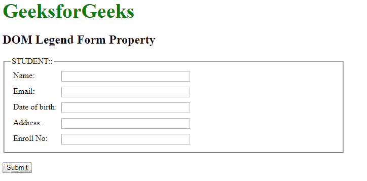
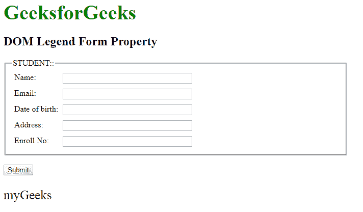

# HTML | DOM 图例表单属性

> 原文:[https://www . geesforgeks . org/html-DOM-legend-form-property/](https://www.geeksforgeeks.org/html-dom-legend-form-property/)

**DOM 图例表单属性**用于**返回** *对包含<图例>标记*的表单的引用。成功时返回表单对象的是只读属性。

**语法:**

```html
legendObject.form
```

**返回值:**对包含<图例>元素的<表单>元素的引用。如果<图例>元素不在表单中，则返回 null。

**示例:**本示例返回一个表单属性。

## 超文本标记语言

```html
<!DOCTYPE html>
<html>

<head>
    <title>DOM Legend form Property</title>
    <style>
        form {
            width: 50%;
        }

        label {
            display: inline-block;
            float: left;
            clear: left;
            width: 90px;
            margin: 5px;
            text-align: left;
        }

        input[type="text"] {
            width: 250px;
            margin: 5px 0px;
        }

        .gfg {
            font-size: 40px;
            color: green;
            font-weight: bold;
        }
    </style>
</head>

<body>
    <div class="gfg">GeeksforGeeks</div>
    <h2>DOM Legend Form Property</h2>
    <form id="myGeeks">
        <fieldset>
            <!-- Assigning legend id -->
            <legend id="GFG">STUDENT::</legend>
            <label>Name:</label>
            <input type="text">
            <br>
            <label>Email:</label>
            <input type="text">
            <br>
            <label>Date of birth:</label>
            <input type="text">
            <br>
            <label>Address:</label>
            <input type="text">
            <br>
            <label>Enroll No:</label>
            <input type="text">
        </fieldset>
    </form>
    <br>
    <button onclick="myGeeks()">Submit</button>
    <p id="sudo" style="font-size:25px;"></p>

    <script>
        function myGeeks() {

            // Accessing legend tag
            var g =
                document.getElementById("GFG").form.id;

            document.getElementById(
              "sudo").innerHTML = g;
        }
    </script>
</body>

</html>
```

**输出:**
**点击按钮前:**



**点击按钮后:**



**支持的浏览器:**

*   谷歌 Chrome
*   Mozilla Firefox
*   边缘
*   歌剧
*   狩猎