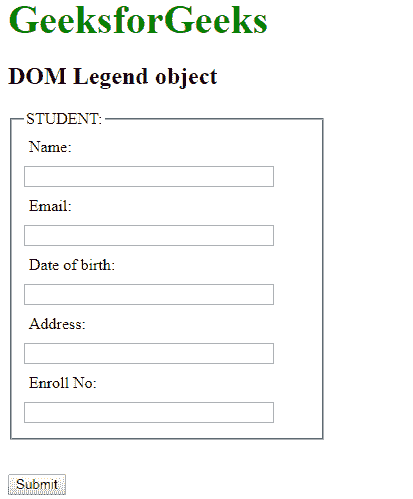

# HTML | DOM 图例对象

> 原文:[https://www.geeksforgeeks.org/html-dom-legend-object/](https://www.geeksforgeeks.org/html-dom-legend-object/)

**DOM 图例对象**用于表示 HTML [<图例>](https://www.geeksforgeeks.org/html-legend-tag/) 元素。*图例*元素由 **getElementById()** 访问。
**属性:**

*   [**表单:**](https://www.geeksforgeeks.org/html-dom-legend-form-property/?ref=rp) 用于返回包含图例元素的表单的引用。

**语法:**

```html
document.getElementById("ID">);
```

其中**“id”**是分配给**“传说”**标签的 ID。
**例-1:**

## 超文本标记语言

```html
<!DOCTYPE html>
<html>

<head>
    <title>DOM Legend Object</title>
    <style>
        form {
            width: 50%;
        }

        label {
            display: inline-block;
            float: left;
            clear: left;
            width: 90px;
            margin: 5px;
            text-align: left;
        }

        input[type="text"] {
            width: 250px;
            margin: 5px 0px;
        }

        .gfg {
            font-size: 40px;
            color: green;
            font-weight: bold;
        }
    </style>
</head>

<body>
    <div class="gfg">GeeksforGeeks</div>
    <h2>DOM Legend object</h2>
    <form>
        <fieldset>
            <!-- Assigning legend id -->
            <legend id="GFG">STUDENT::</legend>
            <label>Name:</label>
            <input type="text">
            <br>
            <label>Email:</label>
            <input type="text">
            <br>
            <label>Date of birth:</label>
            <input type="text">
            <br>
            <label>Address:</label>
            <input type="text">
            <br>
            <label>Enroll No:</label>
            <input type="text">
        </fieldset>
    </form>
    <br>
    <button onclick="myGeeks()">Submit</button>
    <script>
        function myGeeks() {

            // Accessing legend tag
            var g = document.getElementById("GFG");
            g.style.color = "coral";
            g.style.fontSize = "20px";
        }
    </script>
</body>

</html>        
```

**输出:**
**点击按钮前:**


**点击按钮后:**


**示例-2 :** 可以使用**文档.创建元素**方法创建图例对象。

## 超文本标记语言

```html
<!DOCTYPE html>
<html>

<head>
    <title>DOM Legend Object</title>
    <style>
        form {
            width: 50%;
        }

        label {
            display: inline-block;
            float: left;
            clear: left;
            width: 90px;
            margin: 5px;
            text-align: left;
        }

        input[type="text"] {
            width: 250px;
            margin: 5px 0px;
        }

        .gfg {
            font-size: 40px;
            color: green;
            font-weight: bold;
        }
    </style>
</head>

<body>
    <div class="gfg">GeeksforGeeks</div>
    <h2>DOM Legend object</h2>
    <form>
        <fieldset id="GFG">

            <label>Name:</label>
            <input type="text">
            <br>
            <label>Email:</label>
            <input type="text">
            <br>
            <label>Date of birth:</label>
            <input type="text">
            <br>
            <label>Address:</label>
            <input type="text">
            <br>
            <label>Enroll No:</label>
            <input type="text">
        </fieldset>
    </form>
    <br>
    <button onclick="myGeeks()">Submit</button>
    <script>
        function myGeeks() {
            // Legend object created
            var g = document.createElement("LEGEND");
            var f = document.createTextNode("STUDENT:");
            g.appendChild(f);
            document.getElementById("GFG").appendChild(g);

        }
    </script>
</body>

</html>
```

**输出:**
**点击按钮前:**


**点击按钮后:**



**支持的浏览器:****DOM Legend 对象**支持的浏览器如下:

*   谷歌 Chrome
*   微软公司出品的 web 浏览器
*   火狐浏览器
*   歌剧
*   旅行队