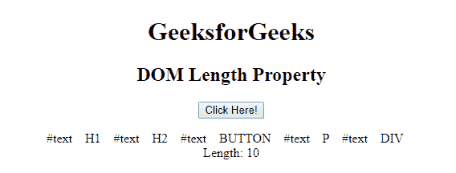

# HTML | DOM 长度属性

> 原文:[https://www.geeksforgeeks.org/html-dom-length-property/](https://www.geeksforgeeks.org/html-dom-length-property/)

HTML 中的 **DOM 长度属性**用于获取 NodeList 对象中的项数。节点列表是子节点的集合。例如，正文的节点列表将包含正文中的所有子节点，即段落、注释、标题、脚本等。
**语法:**

```html
nodelist.length
```

**返回值:**返回一个代表节点列表中节点数量的数值。

下面的程序说明了 HTML 中的 DOM 长度属性:
**示例:**

## 超文本标记语言

```html
<!DOCTYPE html>
<html>
    <head>
        <title>
            DOM Length Property
        </title>

        <script>

            function geeksFunction() {

                var node_list = document.body.childNodes;
                var elements = "";
                var i;
                for (i = 0; i < node_list.length; i++) {
                    elements = elements + node_list[i].nodeName
                    + "    ";
                }

                elements = elements + "<br> Length: "
                + document.body.childNodes.length;
                document.getElementById("demo").innerHTML =
                                                      elements;
            }
        </script>
    </head>

    <body style = "text-align:center">

        <h1>GeeksforGeeks</h1>

        <h2>DOM Length Property</h2>

        <button onclick="geeksFunction()">Click Here!</button>
        <p id="demo"></p>

    </body>
</html>                   
```

之前点击按钮:


点击按钮后:



**支持的浏览器:**由 *DOM length 属性*支持的浏览器如下:

*   谷歌 Chrome
*   微软公司出品的 web 浏览器
*   火狐浏览器
*   歌剧
*   旅行队