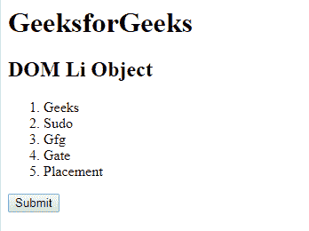
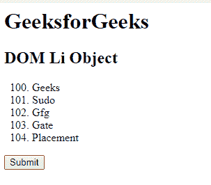
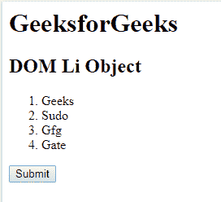

# HTML | DOM li 对象

> 原文:[https://www.geeksforgeeks.org/html-dom-li-object/](https://www.geeksforgeeks.org/html-dom-li-object/)

**DOM Li 对象**用于表示 HTML [< li >](https://www.geeksforgeeks.org/html-li-tag/) 元素。通过 **getElementById()** 访问 *li* 元素。
**属性:**

*   [**值**](https://www.geeksforgeeks.org/html-dom-li-value-property/) **:** 它有一个名为**值**的属性，用于返回< li >标签的值属性的值

**语法:**

```html
document.getElementById("ID");
```

其中**“身份证”**是分配给**“李”**标签的身份证。
**例-1:**

## 超文本标记语言

```html
<!DOCTYPE html>
<html>

<head>
    <title>DOM li Object</title>
</head>

<body>
    <h1>GeeksforGeeks</h1>
    <h2>DOM Li Object </h2>
    <ol>
        <!-- Assigning id to 'li tag' -->
        <li id="GFG">Geeks</li>
        <li>Sudo</li>
        <li>Gfg</li>
        <li>Gate</li>
        <li>Placement</li>
    </ol>
    <button onclick="myGeeks()">Submit</button>
    <script>
        function myGeeks() {
            // Accessing 'li' tag.
            var g = document.getElementById("GFG");
            g.value = "100";
        }
    </script>
</body>

</html>
```

**输出:**
**点击按钮前:**



**点击按钮后:**



**示例-2:** *< li >* 可以使用 **document.createElement** 方法创建对象。

## 超文本标记语言

```html
<!DOCTYPE html>
<html>

<head>
    <title>DOM li Object</title>
</head>

<body>
    <h1>GeeksforGeeks</h1>
    <h2>DOM Li Object </h2>
    <ol ID="GFG">
        <li>Geeks</li>
        <li>Sudo</li>
        <li>Gfg</li>
        <li>Gate</li>
    </ol>
    <button onclick="myGeeks()">Submit</button>
    <script>
        function myGeeks() {
            // li tag created.
            var G = document.createElement("LI");
            var F = document.createTextNode("Placement");
            G.appendChild(F);
            document.getElementById("GFG").appendChild(G);
        }
    </script>
</body>

</html>
```

**输出:**
**点击按钮前:**



**点击按钮后:**


**支持的浏览器:****DOM Li Object**支持的浏览器如下:

*   谷歌 Chrome
*   微软公司出品的 web 浏览器
*   火狐浏览器
*   歌剧
*   旅行队