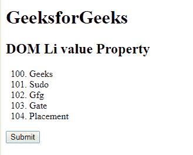
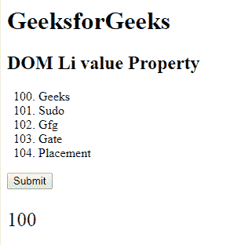
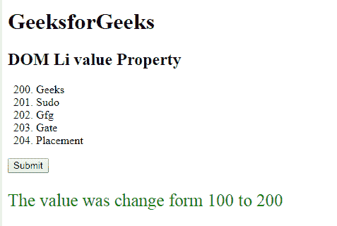

# HTML | DOM li 值属性

> 原文:[https://www.geeksforgeeks.org/html-dom-li-value-property/](https://www.geeksforgeeks.org/html-dom-li-value-property/)

**DOM Li 值属性**用于**设置**或**返回** *列表项的值属性的值*。**值属性**用于**设置**列表项的值，其他列表项将从该数值开始递增。
该值可以是数字和字母。

**语法:**

*   返回 value 属性。

    ```html
    liObject.value
    ```

*   它用于设置 value 属性。

    ```html
    liObject.value = number
    ```

**属性值:**包含一个值，即**号**，指定列表项的值。

**返回值:**返回一个代表列表项值的数值。

**示例-1:** 本示例返回属性值。

```html
<!DOCTYPE html>
<html>

<head>
    <title>
      DOM li value Property
  </title>
</head>

<body>
    <h1>GeeksforGeeks</h1>
    <h2>
      DOM Li value Property 
  </h2>
    <ol>
        <!-- Assigning id to 'li tag' -->
        <li id="GFG" 
            value="100">
          Geeks
      </li>
        <li>Sudo</li>
        <li>Gfg</li>
        <li>Gate</li>
        <li>Placement</li>
    </ol>
    <button onclick="myGeeks()">
      Submit
  </button>
    <p id="sudo"
       style="font-size:25px;
              color:green;">
  </p>
    <script>
        function myGeeks() {
            // Accessing 'li' tag. 
            var g = 
                document.getElementById("GFG").value;
            document.getElementById(
              "sudo").innerHTML = g;
        }
    </script>
</body>

</html>
```

**输出:**
**点击按钮前:**

**点击按钮后:**


**示例-2:** 本示例设置属性值。

```html
<!DOCTYPE html>
<html>

<head>
    <title>
      DOM li value Property
  </title>
</head>

<body>
    <h1>GeeksforGeeks</h1>
    <h2>
      DOM Li value Property
  </h2>
    <ol>
        <!-- Assigning id to 'li tag' -->
        <li id="GFG"
            value="100">
          Geeks
      </li>
        <li>Sudo</li>
        <li>Gfg</li>
        <li>Gate</li>
        <li>Placement</li>
    </ol>
    <button onclick="myGeeks()">
      Submit
  </button>
    <p id="sudo" 
       style="font-size:25px;
              color:green;">
  </p>
    <script>
        function myGeeks() {
            // Accessing 'li' tag. 
            var g = 
                document.getElementById(
                  "GFG").value = "200";

            document.getElementById(
              "sudo").innerHTML = 
              "The value was change form 100 to " + g;
        }
    </script>
</body>

</html>
```

**输出:**
**点击按钮前:**

**点击按钮后:**


**支持的浏览器:**

*   谷歌 Chrome
*   Mozilla Firefox
*   边缘
*   歌剧
*   旅行队