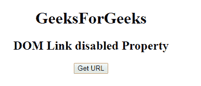
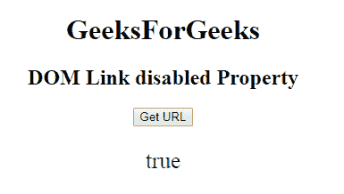
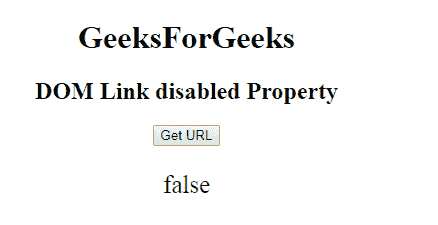

# HTML | DOM 链接禁用属性

> 原文:[https://www . geesforgeks . org/html-DOM-link-disabled-property/](https://www.geeksforgeeks.org/html-dom-link-disabled-property/)

**DOM 链接禁用属性**用于**设置**或**返回** *链接文档是否禁用*。此属性仅用于样式表链接。

**语法:**

*   它返回禁用的属性:。

```html
linkObject.disabled
```

*   它用于设置禁用属性。

```html
linkObject.disabled = true|false
```

**属性值:**

*   **true:** 指定链接文档将被禁用。
*   **false:** 指定链接的文档不会被禁用。

**返回值:**返回一个布尔值，表示链接文档是否被禁用。
**示例-1:** 本示例返回禁用的属性。

## 超文本标记语言

```html
<!DOCTYPE html>
<html>

<head>
    <link id="linkid"
          rel="stylesheet"
          type="text/css"
          href="styles.css"
          sizes="16*16"
          hreflang="en-us"
          disabled>
</head>

<body style="text-align:center;">
    <h1>GeeksForGeeks</h1>
    <h2>DOM Link disabled Property</h2>

    <button onclick="gfg()">Get URL
    </button>

    <p id="pid"
       style="font-size:25px;
              color:green;">
  </p>

    <script>
        function gfg() {

            // Access link element.
            var NEW = document.getElementById(
                "linkid").disabled;
            document.getElementById(
                "pid").innerHTML = NEW;
        }
    </script>

</body>

</html>
```

**输出:**
**点击按钮前:**



**点击按钮后:**



**示例-2:** 本示例设置禁用属性。

## 超文本标记语言

```html
<!DOCTYPE html>
<html>

<head>
    <link id="linkid"
          rel="stylesheet"
          type="text/css"
          href="styles.css"
          sizes="16*16"
          hreflang="en-us"
          disabled>
</head>

<body style="text-align:center;">
    <h1>GeeksForGeeks</h1>
    <h2>DOM Link disabled Property</h2>

    <button onclick="gfg()">
      Get URL
    </button>

    <p id="pid"
       style="font-size:25px;
              color:green;">
  </p>

    <script>
        function gfg() {

            // Access link element.
            var NEW = document.getElementById(
                "linkid").disabled = "false";
            document.getElementById(
                "pid").innerHTML = NEW;
        }
    </script>

</body>

</html>
```

**输出:**
**点击按钮前:**


**点击按钮后:**



**支持的浏览器:**

*   谷歌 Chrome
*   Mozilla Firefox
*   边缘
*   旅行队
*   歌剧