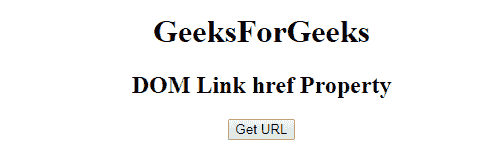
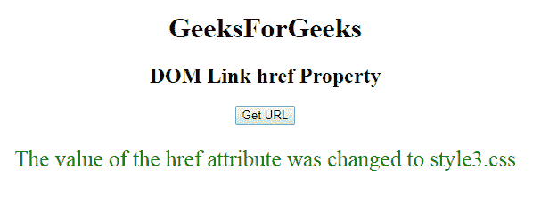

# HTML | DOM 链接 href 属性

> 原文:[https://www.geeksforgeeks.org/html-dom-link-href-property/](https://www.geeksforgeeks.org/html-dom-link-href-property/)

The **HTML | DOM Link href Property** is used to **set** or **return** *the URL of a Linked Document*.

**语法:**

*   它返回 href 属性。

    ```html
    linkObject.href
    ```

*   它用于设置 href 属性。

    ```html
    linkObject.href = URL 
    ```

**属性值:**它包含指定链接网址的值，即网址。

*   **绝对 URL:** 指向另一个网站。
*   **相对 URL:** 它指向网站内的一个文件。
*   **锚点 URL:** 它指向页面内的一个锚点。

**返回值:**返回一个字符串值，代表链接文档的网址。

**示例-1:** 本示例返回一个 href 属性。

```html
<!DOCTYPE html>
<html>

<head>
    <link id="linkid" 
          rel="stylesheet"
          type="text/css" 
          href="styles.css" 
          sizes="16*16"
          hreflang="en-us">
</head>

<body style="text-align:center;">
    <h1>GeeksForGeeks</h1>
    <h2>DOM Link href Property</h2>

    <button onclick="gfg()">Get URL
    </button>

    <p id="pid" 
       style="font-size:25px;
              color:green;">
  </p>

    <script>
        function gfg() {

            // Access link element. 
            var NEW = document.getElementById(
                "linkid").href;
            document.getElementById(
                "pid").innerHTML = NEW;
        }
    </script>

</body>

</html>
```

**输出:**
**点击按钮前:**


**点击按钮后:**


**示例-2:** 本示例设置 href 属性。

```html
<!DOCTYPE html>
<html>

<head>
    <link id="linkid" 
          rel="stylesheet"
          type="text/css" 
          href="styles.css" 
          sizes="16*16"
          hreflang="en-us">
</head>

<body style="text-align:center;">
    <h1>GeeksForGeeks</h1>
    <h2>DOM Link href Property</h2>

    <button onclick="gfg()">Get URL
    </button>

    <p id="pid" 
       style="font-size:25px;
              color:green;">
  </p>

    <script>
        function gfg() {

            // Access link element. 
            var NEW = document.getElementById(
                "linkid").href = "style3.css";

            document.getElementById(
                "pid").innerHTML = 
              "The value of the href attribute"+
              " was changed to " + NEW;
        }
    </script>

</body>

</html>
```

**输出:**

**点击按钮前:**

**点击按钮后:**


**支持的浏览器:**

*   谷歌 Chrome
*   Mozilla Firefox
*   边缘
*   旅行队
*   歌剧