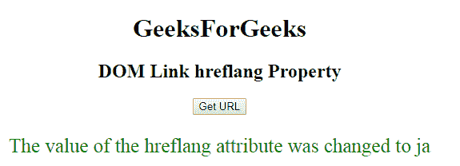

# HTML | DOM 链接 hreflang 属性

> 原文:[https://www . geesforgeks . org/html-DOM-link-hre flang-property/](https://www.geeksforgeeks.org/html-dom-link-hreflang-property/)

**DOM 链接 hreflant 属性**用于**设置**或**返回**链接文档 hreflant 属性的*值。hreflang 属性用于指定链接文档的语言。*

**语法:**

*   它返回 hreflang 属性。

    ```html
    linkObject.hreflang
    ```

*   它用于设置 hreflang 属性。

    ```html
    linkObject.hreflang = languagecode
    ```

**属性值:**包含指定链接文档语言代码的值，即**语言代码**。

**返回值:**返回一个字符串值，代表链接文档的语言代码。

**示例-1:** 本示例返回 hreflang 属性。

```html
<!DOCTYPE html>
<html>

<head>
    <link id="linkid" 
          rel="stylesheet" 
          type="text/css" 
          href="styles.css" 
          sizes="16*16"
          hreflang="en-us">
</head>

<body style="text-align:center;">
    <h1>GeeksForGeeks</h1>
    <h2>
      DOM Link hreflang Property
  </h2>

    <button onclick="gfg()">
      Get URL
    </button>

    <p id="pid" 
       style="font-size:25px;
              color:green;">
  </p>

    <script>
        function gfg() {

            // Access link element. 
            var NEW = document.getElementById(
                "linkid").hreflang;
            document.getElementById(
                "pid").innerHTML = NEW;
        }
    </script>

</body>

</html>
```

**输出:**

**点击按钮前:**

**点击按钮后:**


**示例-2:** 本示例设置 hreflang 属性。

```html
<!DOCTYPE html>
<html>

<head>
    <link id="linkid" 
          rel="stylesheet" 
          type="text/css" 
          href="styles.css" 
          sizes="16*16" 
          hreflang="en-us">
</head>

<body style="text-align:center;">
    <h1>GeeksForGeeks</h1>
    <h2>
      DOM Link hreflang Property
  </h2>

    <button onclick="gfg()">Get URL
    </button>

    <p id="pid" 
       style="font-size:25px;
              color:green;">
  </p>

    <script>
        function gfg() {

            // Access link element. 
            var NEW = document.getElementById(
                "linkid").hreflang = "ja";

            document.getElementById(
                "pid").innerHTML = 
              "The value of the hreflang"+
              " attribute was changed to " + NEW;
        }
    </script>

</body>

</html>
```

**输出:**
**点击按钮前:**

**点击按钮后:**


**支持的浏览器:**

*   谷歌 Chrome
*   Mozilla Firefox
*   边缘
*   旅行队
*   歌剧