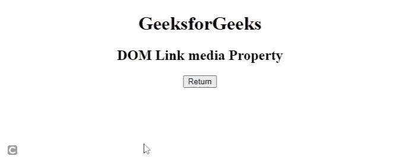

# HTML DOM 链接媒体属性

> 原文:[https://www.geeksforgeeks.org/html-dom-link-media-property/](https://www.geeksforgeeks.org/html-dom-link-media-property/)

**HTML DOM** [**链接媒体**](https://www.geeksforgeeks.org/html-link-media-attribute/) 属性用于设置或返回一个 [<链接>](https://www.geeksforgeeks.org/html-link-media-attribute/) 元素的**媒体**属性的值。*媒体*属性用于指定优化目标资源的媒体设备类型。

**语法:**

*   用于返回*媒体*属性。

    ```html
    linkObject.media; 
    ```

*   用于设置*媒体*属性。

    ```html
    linkObject.media="values" 
    ```

**属性值:**

*   **全部:**适用于所有设备
*   **听觉:**语音合成器
*   **盲文:**盲文反馈装置
*   **手持:**手持设备(小屏幕，有限带宽)
*   **投影:**投影仪
*   **打印:**打印预览模式/打印页数
*   **屏幕:**电脑屏幕
*   **tty:** 使用固定间距字符网格的电传打字机和类似介质
*   **电视:**低分辨率或滚动能力有限的类型设备，如电视。

**返回值:**返回一个字符串值，代表媒体类型逗号分隔列表。

**示例:**下面的 HTML 代码说明了，如何返回链接媒体属性。

## 超文本标记语言

```html
<!DOCTYPE html>
<html>

<head>
    <link id="linkid" rel="stylesheet" 
        type="text/css" href="" media="screen">
</head>

<body style="text-align:center;">
    <h1>GeeksforGeeks</h1>
    <h2>DOM Link media Property</h2>

    <button onclick="btnclick()">Return</button>

    <p id="pid" style="font-size:25px;color:green;">
    </p>

    <script>
        function btnclick() {

            // Access link element.
            var newVar = document
                .getElementById("linkid").media;

            document.getElementById(
                "pid").innerHTML = newVar;
        }
    </script>
</body>

</html>
```

**输出:**



**支持的浏览器:**

*   谷歌 Chrome
*   微软公司出品的 web 浏览器
*   火狐浏览器
*   歌剧
*   苹果 Safari