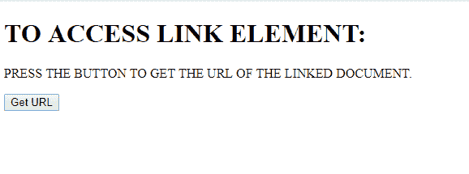
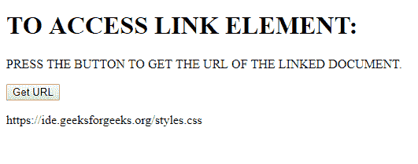
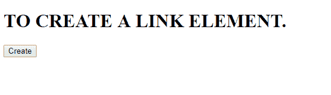
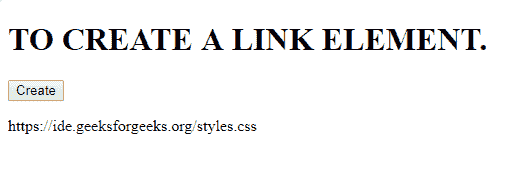

# HTML | DOM 链接对象

> 原文:[https://www.geeksforgeeks.org/html-dom-link-object/](https://www.geeksforgeeks.org/html-dom-link-object/)

HTML DOM 链接对象用于访问 **HTML <链接>元素**。
**语法:**

*   要访问一个 HTML 元素:

```html
document.getElementById("myLink");  
```

*   要创建新的 HTML 元素:

```html
document.getElementById("myLink"); 
```

**property tie Values:**

<figure class="table">

| 价值 | 描述 |
| 字符集 | Assign the character encoding of the linked document |
| 交叉起源 | CORS settings for assigning linked documents |
| forbidden | Is the linked document disabled, yes or no |
| href | The URL used to set/return the linked document |
| 元首万岁 | It assigns the language code of the linked document. |
| medium | It assigns the media type of the linked element. |
| 能量损耗率 | It assigns the current reverse relationship from the linked document to the current document. |
| 大小 | Returns the value of the size property of the linked resource. |
| type | Sets/returns the content type of the linked document. |

</figure>

**示例-1:** 访问链接元素。

## 超文本标记语言

```html
<!DOCTYPE html>
<html>

<head>
    <link id="linkid"
          rel="stylesheet"
          type="text/css"
          href="styles.css">
</head>

<body>
    <h1>TO ACCESS LINK ELEMENT:</h1>

<p>PRESS THE BUTTON TO GET THE URL
      OF THE LINKED DOCUMENT.</p>

    <button onclick="gfg()">Get URL
  </button>

    <p id="pid"></p>

    <script>
        function gfg() {

            // Access link element.
            var NEW = document.getElementById(
              "linkid").href;
            document.getElementById(
              "pid").innerHTML = NEW;
        }
    </script>

</body>

</html>
```

**输出:**
**点击前:**



**点击后:**



**示例-2:** 创建链接元素。

## 超文本标记语言

```html
<!DOCTYPE html>
<html>

<head>
</head>

<body>
    <h1>TO CREATE A LINK ELEMENT.</h1>

    <button onclick="myFunction()">Create</button>
    <p id="pid"></p>

    <script>
        function myFunction() {

            // Create link element.
            var NEW = document.createElement(
              "LINK");

            // set attributes.
            NEW.setAttribute("id", "linkid");
            NEW.setAttribute("rel", "stylesheet");
            NEW.setAttribute("type", "text/css");
            NEW.setAttribute("href", "styles.css");
            document.head.appendChild(NEW);

            var NEW1 = document.getElementById(
              "linkid").href;
            document.getElementById("pid").innerHTML =
              NEW1;

        }
    </script>

</body>

</html>
```

**输出:**
**点击前:**



**点击后:**



**支持的浏览器:**

*   铬
*   火狐浏览器
*   微软公司出品的 web 浏览器
*   旅行队
*   歌剧