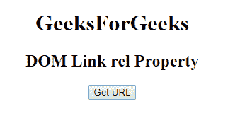
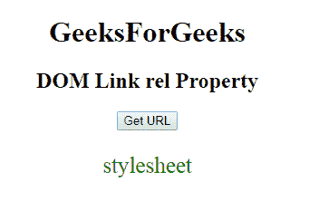
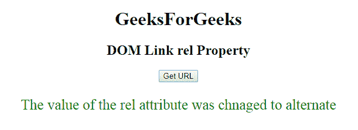

# HTML | DOM 链接相关属性

> 原文:[https://www.geeksforgeeks.org/html-dom-link-rel-property/](https://www.geeksforgeeks.org/html-dom-link-rel-property/)

HTML DOM 中的 **HTML | DOM 链接 rel 属性**用于**设置**或**返回** *链接文档的 rel 属性值*。rel 属性用于指定当前文档和链接文档之间的关系。

**语法:**

*   它返回 rel 属性。

```html
linkObject.rel
```

*   它用于设置 rel 属性。

```html
linkObject.rel = relationship
```

**属性值:**

*   **替代版本:**它定义了文档的替代版本，即打印页面、翻译版本或镜像版本。
*   **作者:**定义文档的作者。
*   **dns-预取:**用于指定浏览器应该抢先执行目标资源来源的 DNS 解析
*   **帮助:**提供帮助链接。
*   **图标:**用于导入一个图标来表示文档。
*   **许可:**定义文档的版权信息。
*   **下一个:**它提供了一个到选择中下一个文档的链接。
*   **pingback:** 用于提供 pingback 服务器的地址，用于处理当前文档的 pingback。
*   **预连接:**用于指定浏览器应抢先连接到目标资源的源。
*   **预取:**用于指定浏览器应抢先获取并缓存目标资源，后续导航很可能需要
*   **预加载:**用于指定浏览器代理必须根据“as”属性给定的目的地，抢先获取并缓存当前导航的目标资源。
*   **prev:** 指定选择中的上一个文档。
*   **搜索:**指定通过文档的链接搜索。
*   **样式表:**是导入样式表。

**返回值:**返回一个字符串值，代表一个用空格分隔的关系类型列表

**示例-1:** 本示例返回一个 rel 属性。

## 超文本标记语言

```html
<!DOCTYPE html>
<html>

<head>
    <link id="linkid"
          rel="stylesheet"
          type="text/css"
          href="styles.css"
          sizes="16*16">
</head>

<body style="text-align:center;">
    <h1>GeeksForGeeks</h1>
    <h2>DOM Link rel Property</h2>

    <button onclick="gfg()">Get URL
    </button>

    <p id="pid"
       style="font-size:25px;
              color:green;"></p>

    <script>
        function gfg() {

            // Access link element.
            var NEW = document.getElementById(
                "linkid").rel;
            document.getElementById(
                "pid").innerHTML = NEW;
        }
    </script>

</body>

</html>
```

**输出:**
**点击按钮前:**



**点击按钮后:**



**示例-2:** 本示例设置 rel 属性。

## 超文本标记语言

```html
<!DOCTYPE html>
<html>

<head>
    <link id="linkid"
          rel="stylesheet"
          type="text/css"
          href="styles.css"
          sizes="16*16">
</head>

<body style="text-align:center;">
    <h1>GeeksForGeeks</h1>
    <h2>DOM Link rel Property</h2>

    <button onclick="gfg()">Get URL
    </button>

    <p id="pid"
       style="font-size:25px;
              color:green;">
  </p>

    <script>
        function gfg() {

            // Access link element.
            var NEW = document.getElementById(
                "linkid").rel = "alternate";
            document.getElementById(
                "pid").innerHTML =
        "The value of the rel attribute was changed to "
            + NEW;
        }
    </script>

</body>

</html>
```

**输出:**
**点击按钮前:**


**点击按钮后:**



**支持的浏览器:**

*   谷歌 Chrome
*   Mozilla Firefox
*   边缘
*   旅行队
*   歌剧