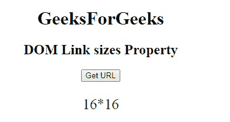

# HTML | DOM 链接大小属性

> 原文:[https://www.geeksforgeeks.org/html-dom-link-sizes-property/](https://www.geeksforgeeks.org/html-dom-link-sizes-property/)

**HTML | DOM 链接大小属性**用于*返回链接文档*的大小属性值。**大小属性**用于指定视觉媒体图标的大小，仅在 **rel="icon"** 时有效。它是只读属性。

**语法:**

```html
linkObject.sizes
```

**返回值:**返回图标的大小。

**示例:**本示例返回 sizes 属性。

```html
<!DOCTYPE html>
<html>

<head>
    <link id="linkid"
          rel="stylesheet" 
          type="text/css" 
          href="styles.css" 
          sizes="16*16">
</head>

<body style="text-align:center;">
    <h1>GeeksForGeeks</h1>
    <h2>DOM Link sizes Property</h2>

    <button onclick="gfg()">Get URL
    </button>

    <p id="pid" 
       style="font-size:25px;color:green;">
  </p>

    <script>
        function gfg() {

            // Access link element. 
            var NEW = document.getElementById(
                "linkid").sizes;
            document.getElementById(
                "pid").innerHTML = NEW;
        }
    </script>

</body>

</html>
```

**输出:**
**点击按钮前:**

**点击按钮后:**


**支持的浏览器:**

*   谷歌 Chrome
*   Mozilla Firefox
*   边缘
*   旅行队
*   歌剧