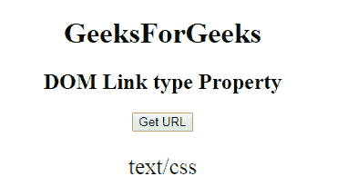

# HTML | DOM 链接类型属性

> 原文:[https://www.geeksforgeeks.org/html-dom-link-type-property/](https://www.geeksforgeeks.org/html-dom-link-type-property/)

**DOM 链接类型属性**用于**设置**或**返回** *链接文档的内容类型或 MIME 类型*。例如文本/css”、“文本/javascript”、“图像/gif”等。

**语法:**

*   它返回类型属性。

    ```html
    linkObject.type
    ```

*   它用于设置类型属性。

    ```html
    linkObject.type = MIME-type
    ```

**属性值:**包含用于指定链接文档的 MIME 类型的值，即 **MIME 类型**。

**返回值:**返回代表链接文档内容类型的字符串值。

**示例:**本示例返回类型属性。

```html
<!DOCTYPE html>
<html>

<head>
    <link id="linkid" 
          rel="stylesheet" 
          type="text/css"
          href="styles.css">
</head>

<body style="text-align:center;">
    <h1>GeeksForGeeks</h1>
    <h2>DOM Link type Property</h2>

    <button onclick="gfg()">Get URL
    </button>

    <p id="pid"
       style="font-size:25px;
              color:green;">
  </p>

    <script>
        function gfg() {

            // Access link element. 
            var NEW = document.getElementById(
                "linkid").type;
            document.getElementById(
                "pid").innerHTML = NEW;
        }
    </script>

</body>

</html>
```

**输出:**
**点击按钮前:**


**点击按钮后:**

**支持的浏览器:**

*   谷歌 Chrome
*   Mozilla Firefox
*   边缘
*   旅行队
*   歌剧