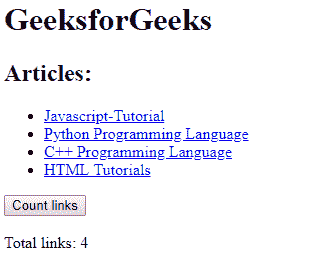
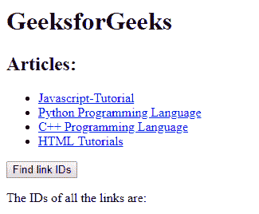
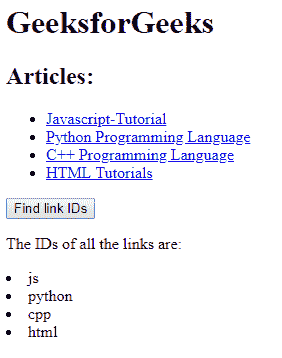
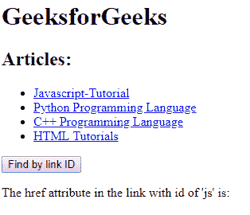
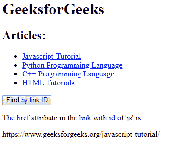

# HTML | DOM 链接集合

> 原文:[https://www.geeksforgeeks.org/html-dom-links-collection/](https://www.geeksforgeeks.org/html-dom-links-collection/)

**DOM 链接集合**用于返回一个 HTML 文档中所有< a >和<区域>元素带有“href”属性的集合。集合中的元素在源代码中出现时进行排序。
**语法:**

```html
document.links
```

**属性**:包含单个属性长度，用于返回集合中< a >和<区域>元素的个数。
**方法**:**DOM 链接集合包含**三种方法，如下所示:

*   **【索引】:**用于返回指定索引的< a >和<区域>元素。索引值以 0 开始。如果索引值超出范围，则返回空值。
*   **项(索引):**用于返回所选索引的< a >和<区域>元素。索引值以 0 开始。如果索引值超出范围，则返回空值。此方法的执行类似于上述方法。
*   **name item(id):**用于从集合中返回与指定 id 匹配的< a >和<区域>元素。如果 id 不存在，则返回空值。

**返回值:**一个 HTMLCollection 对象，表示文档中所有<一个>元素和/或<区域>元素。集合中的元素在源代码中出现时进行排序

下面的程序说明了 documents.links 属性在 HTML 中的使用:
**示例 1:** 使用 length 属性来计算集合中链接元素的数量。

## 超文本标记语言

```html
<!DOCTYPE html>
<html>

<head>
    <title>
        DOM document.links() Property
    </title>

    <!-- script to count links -->
    <script>
        function countLinks() {

            let collection = document.links.length;

            document.querySelector(".count").innerHTML =
                collection;
        }
    </script>
</head>

<body>
    <h1>GeeksforGeeks</h1>

    <h2>Articles:</h2>

    <ul>

        <!-- list of links -->
        <li><a id="js" href=
"https://www.geeksforgeeks.org/javascript-tutorial/">
                Javascript-Tutorial
            </a></li>

        <li><a id="python" href=
"https://www.geeksforgeeks.org/python-programming-language/">
                Python Programming Language
            </a></li>

        <li><a id="cpp" href=
"https://www.geeksforgeeks.org/c-plus-plus/">
                C++ Programming Language
            </a></li>

        <li><a id="html" href=
"https://www.geeksforgeeks.org/html-tutorials/">
                HTML Tutorials
            </a></li>
    </ul>

    <!-- button to count number of links -->
    <button onclick="countLinks()">
      Count links
    </button>
    <br>
    <br>

    <span>Total links: </span>
    <span class="count"></span>
</body>

</html>
```

**输出:**



**示例 2:** 查找文档中所有链接并返回其 id 的 HTML 代码。

## 超文本标记语言

```html
<!DOCTYPE html>
<html>

<head>
    <title>
        DOM document.links() Property
    </title>

    <script>
        /* function to find IDs */
        function findLinkIDs() {
            let final = '';
            let collection = document.links;

            // Run a for loop upto the number of
            // links in the collection
            for (let i = 0; i < collection.length; i++) {

                // Add each link id to a list
                final += `<li> ${collection[i].id} </li>`;
            }

            // Replace the HTML of the ID div
            document.querySelector(".ids").innerHTML =
                  final;
        }
    </script>
</head>

<body>
    <h1>GeeksforGeeks</h1>

    <h2>Articles:</h2>

    <ul>

        <!-- list of links -->
        <li><a id="js" href=
"https://www.geeksforgeeks.org/javascript-tutorial/">
                Javascript-Tutorial
            </a></li>

        <li><a id="python" href=
"https://www.geeksforgeeks.org/python-programming-language/">
                Python Programming Language
            </a></li>

        <li><a id="cpp" href=
"https://www.geeksforgeeks.org/c-plus-plus/">
                C++ Programming Language
            </a></li>

        <li><a id="html" href=
"https://www.geeksforgeeks.org/html-tutorials/">
                HTML Tutorials
            </a></li>
    </ul>

    <!-- button to find id -->
    <button onclick="findLinkIDs()">
      Find link IDs
    </button>

<p>The IDs of all the links are: </p>

    <div class="ids"></div>
</body>

</html>
```

**输出:**
**之前点击按钮:**



**点击按钮后:**



**示例 3:** 使用 id 属性按链接 ID 查找并显示其 href 属性

## 超文本标记语言

```html
<!DOCTYPE html>
<html>

<head>
    <title>
        DOM document.links() Property
    </title>

    <script>
        function returnLinkByID() {
            let collection =
                document.links.namedItem("js");

            // Get the href attribute
            let link = collection.href;

            document.querySelector(".name").innerHTML =
                link;

        }
    </script>
</head>

<body>
    <h1>GeeksforGeeks</h1>

    <h2>Articles:</h2>

    <ul>

        <!-- collection of links -->
        <li><a id="js" href=
"https://www.geeksforgeeks.org/javascript-tutorial/">
                Javascript-Tutorial
            </a></li>

        <li><a id="python" href=
"https://www.geeksforgeeks.org/python-programming-language/">
                Python Programming Language
            </a></li>

        <li><a id="cpp" href=
"https://www.geeksforgeeks.org/c-plus-plus/">
                C++ Programming Language
            </a></li>

        <li><a id="html" href=
"https://www.geeksforgeeks.org/html-tutorials/">
                HTML Tutorials
            </a></li>
    </ul>

    <button onclick="returnLinkByID()">
        Find by link ID
    </button>

<p>
      The href attribute in the link
      with id of 'js' is:
    </p>

    <div class="name"></div>
</body>

</html>
```

**输出:**
之前点击按钮:



**点击按钮后:**



**支持的浏览器:**T2 DOM 链接集合方法支持的浏览器如下:

*   铬
*   微软公司出品的 web 浏览器
*   火狐浏览器
*   歌剧
*   旅行队