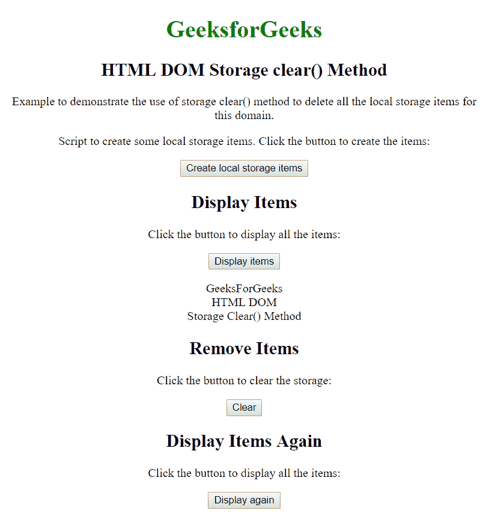

# HTML | DOM 本地存储清除()方法

> 原文:[https://www . geesforgeks . org/html-DOM-local-storage-clear-method/](https://www.geeksforgeeks.org/html-dom-local-storage-clear-method/)

**清除()方法**删除当前域的所有存储对象项目。
**语法:**

```html
localStorage.clear()
```

**房产价值:**
无房产价值

**示例:**设置项目，清除并显示当前域。

```html
<!DOCTYPE html>
<html>

<head>
    <style>
        body {
            text-align: center;
        }

        h1 {
            color: green;
        }
    </style>
</head>

<body>
    <h1>GeeksforGeeks</h1>

    <h2>HTML DOM Storage clear() Method</h2>

    <p>
      Example to demonstrate the use of storage
      clear() method to delete all the local 
      storage items for this domain.
    </p>

    <p>
      Script to create some local storage items.
      Click the button to create the items:
    </p>

    <button onclick="createItems()">
        Create local storage items
    </button>

    <h2>Display Items</h2>

    <p>
      Click the button to display all the items:
    </p>

    <button onclick="displayItems()">
      Display items
    </button>
    <p id="demo"></p>

    <h2>Remove Items</h2>

    <p>
      Click the button to clear the storage:
    </p>

    <button onclick="deleteItems()">
      Clear
    </button>

    <h2>Display Items Again</h2>

    <p>
      Click the button to display all the items:
    </p>

    <button onclick="displayItems()">
      Display again
    </button>
    <p id="demo"></p>

    <script>
        function createItems() {

            // Set item in local storage.
            localStorage.setItem("GeeksForGeeks", "");
            localStorage.setItem("HTML DOM", "");
            localStorage.setItem("Storage Clear() Method", "");
        }

        function deleteItems() {
            // Clear local storage items.
            localStorage.clear();
        }

        function displayItems() {
            var l, i;
            // Display items.
            document.getElementById("demo").innerHTML = "";
            for (i = 0; i < localStorage.length; i++) {
                x = localStorage.key(i);
                document.getElementById("demo").innerHTML += x;
            }
        }
    </script>

</body>

</html>
```

**输出:**


**支持的浏览器:***DOM Local Storage clear()*支持的浏览器如下:

*   谷歌 Chrome 4.0
*   Internet Explorer 8.0
*   密西西里亚 Firefox 3.5
*   歌剧 10.5
*   Safari 4.0