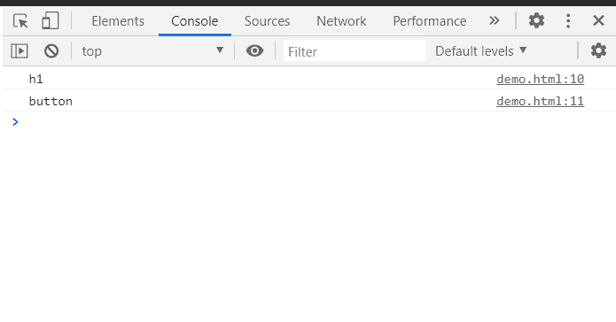

# HTML DOM localName 属性

> 原文:[https://www.geeksforgeeks.org/html-dom-localname-property/](https://www.geeksforgeeks.org/html-dom-localname-property/)

**HTML DOM localName** 属性返回元素的本地名称。这是只读属性。

**语法:**

```html
element.localName
```

**返回值:**表示元素本地名称的字符串。

**示例:**

下面的示例演示如何使用此属性获取元素的本地名称。

```html
<html>
   <head>
      <title>GeeksforGeeks</title>
      <h1 id="d">GeeksforGeeks</h1>
      <button id="btn">Click Here</button>
      <script>
          const element = document.getElementById("btn");
          const di=document.getElementById("d");
    element.addEventListener("click", function() {
  console.log(di.localName);
  console.log(element.localName);
});
      </script>
   </head>
</html>
```

**输出:**

**按钮点击前:**


**按钮点击后:**

在控制台中，可以看到以下元素的本地名称。



**支持的浏览器:**

*   谷歌 Chrome
*   边缘
*   火狐浏览器
*   歌剧
*   旅行队