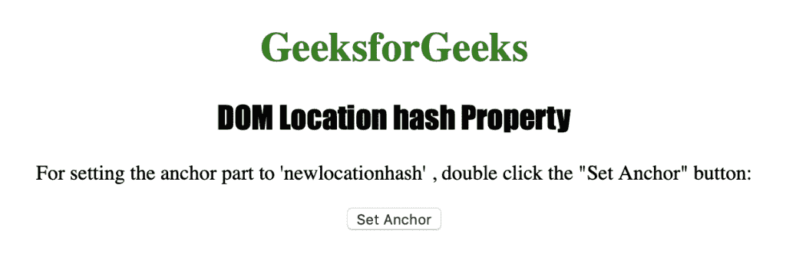

# HTML | DOM 位置哈希属性

> 原文:[https://www . geesforgeks . org/html-DOM-location-hash-property/](https://www.geeksforgeeks.org/html-dom-location-hash-property/)

HTML 中的**位置散列属性**用于返回 URL 的锚点部分。也可以用来设置 URL 的锚点部分。它返回一个字符串，该字符串表示包含哈希符号“#”的 URL 的锚定部分。
**语法:**

*   它返回哈希属性。

```html
location.hash
```

*   它用于设置哈希属性。

```html
location.hash = anchorname
```

**属性值**

**锚点名称:**它包含一个字符串值，用于指定网址的锚点部分。

**返回值:**返回一个字符串值，代表一个网址的锚点部分。

下面的程序说明了 HTML 中的 Location hash 属性:
**示例:**

## 超文本标记语言

```html
<!DOCTYPE html>
<html>

<head>
    <title>DOM Location hash property</title>
    <style>
        h1 {
            color: green;
        }

        h2 {
            font-family: Impact;
        }

        body {
            text-align: center;
        }
    </style>
</head>

<body>
    <h1>GeeksforGeeks</h1>
    <h2>DOM Location hash Property</h2>

<p>
      For setting the anchor part to
      'newlocationhash', double click
      the "Set Anchor" button:
    </p>

    <button ondblclick="mylocation()">
      Set Anchor
    </button>
    <p id="hash"></p>

    <script>
        function mylocation() {
            location.hash = "newlocationhash";
            var h =
                "The anchor part is now: " + location.hash;
            document.getElementById("hash").innerHTML = h;
        }
    </script>
</body>

</html>  
```

**输出:**



**点击按钮后:**


**支持的浏览器:**Location hash 属性支持的浏览器如下:

*   谷歌 Chrome
*   微软公司出品的 web 浏览器
*   火狐浏览器
*   歌剧
*   旅行队