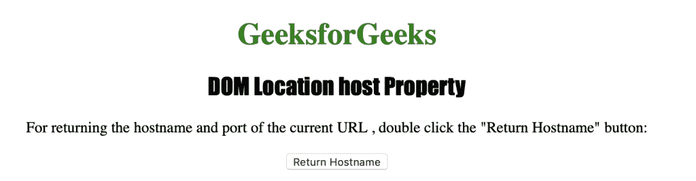
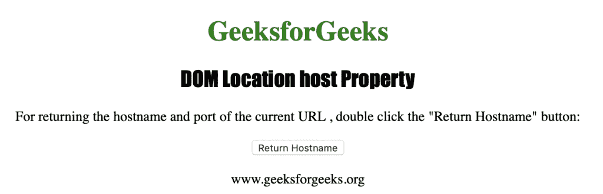

# HTML | DOM 位置主机属性

> 原文:[https://www . geesforgeks . org/html-DOM-location-host-property/](https://www.geeksforgeeks.org/html-dom-location-host-property/)

HTML 中的位置主机属性用于设置或返回网址的主机名和端口。如果网址中没有指定端口号，位置哈希属性不会返回端口号。
**语法:**

*   它返回宿主属性。

```html
location.host
```

*   它用于设置主机属性。

```html
location.host = hostname:port
```

**属性值**

**主机名:端口:**<u>它包含一个字符串值，该值定义了一个网址的主机名和端口号。</u>

**<u>返回值:</u>** 一个字符串，代表域名和端口号，或者 URL 的 IP 地址

下面的程序用 HTML 说明了位置主机属性:
**示例:**

## 超文本标记语言

```html
<!DOCTYPE html>
<html>
    <head>
        <title>DOM Location host Property</title>
        <style>
            h1 {
                color:green;
            }
            h2 {
                font-family: Impact;
            }
            body {
                text-align:center;
            }
        </style>
    </head>
    <body>
        <h1>GeeksforGeeks</h1>
        <h2>DOM Location host Property</h2>

<p>
          For returning the hostname and port
          of the current URL, double-click the
          "Return Hostname" button:
        </p>

        <button ondblclick="myhost()">
          Return Hostname
        </button>
        <p id="host"></p>

        <script>
            function myhost() {
                var h = location.host;
                document.getElementById("host").innerHTML = h;
            }
        </script>
    </body>
</html>                   
```

**输出:**



**点击按钮后:**



**支持的浏览器:**位置主机属性支持的浏览器如下:

*   谷歌 Chrome
*   微软公司出品的 web 浏览器
*   火狐浏览器
*   歌剧
*   旅行队