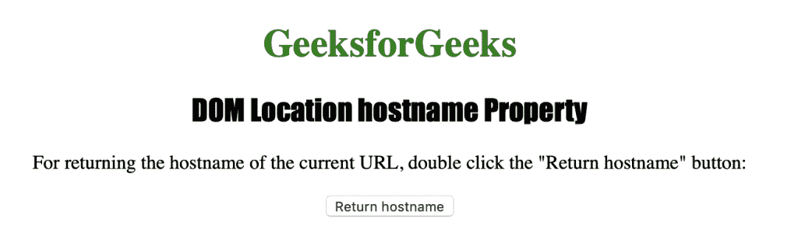
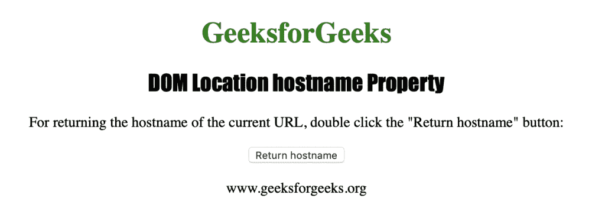

# HTML | DOM 位置主机名属性

> 原文:[https://www . geesforgeks . org/html-DOM-location-hostname-property/](https://www.geeksforgeeks.org/html-dom-location-hostname-property/)

HTML 中的**位置主机名属性**用于返回当前 URL 的主机名。“位置主机名”属性返回一个字符串，该字符串包含域名或网址的 IP 地址。

**语法:**

*   它返回主机名属性。

    ```html
    location.hostname
    ```

*   它用于设置主机名属性。

    ```html
    location.hostname = hostname
    ```

下面的程序说明了 HTML 中的位置主机名属性:

**示例:**

```html
<!DOCTYPE html>
<html>

<head>
    <title>DOM Location hostname Property</title>
    <style>
        h1 {
            color: green;
        }

        h2 {
            font-family: Impact;
        }

        body {
            text-align: center;
        }
    </style>
</head>

<body>
    <h1>GeeksforGeeks</h1>
    <h2>DOM Location hostname Property</h2>
    <p>
      For returning the hostname of the current
      URL, double click the "Return hostname" button:
    </p>
    <button ondblclick="myhost()">
      Return hostname
    </button>
    <p id="hostname"></p>
    <script> 
        function myhost() {
            var h = location.hostname;
            document.getElementById("hostname").innerHTML = h;
        }
    </script>
</body>

</html>
```

**输出:**

**点击按钮后:**


**支持的浏览器:**位置主机名属性支持的浏览器如下:

*   谷歌 Chrome
*   微软公司出品的 web 浏览器
*   火狐浏览器
*   歌剧
*   旅行队