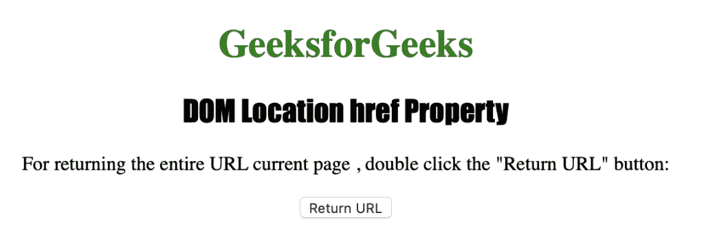
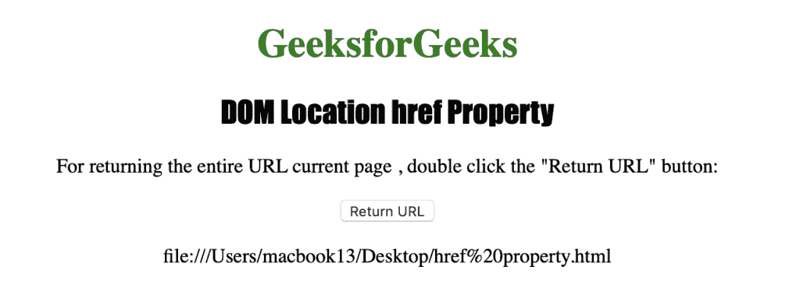
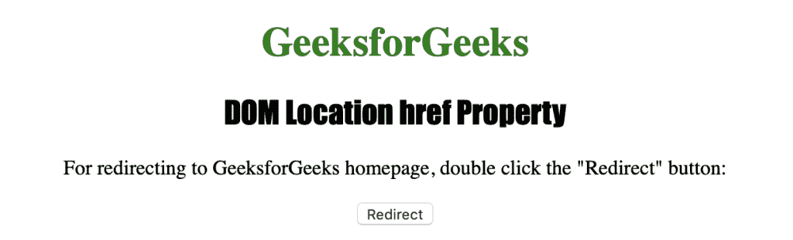

# HTML | DOM 位置 href 属性

> 原文:[https://www . geesforgeks . org/html-DOM-location-href-property/](https://www.geeksforgeeks.org/html-dom-location-href-property/)

HTML 中的 **Location href 属性**用于设置或返回当前页面的完整 URL。Location href 属性也可用于设置指向另一个网站或电子邮件地址的 href 值。Location href 属性返回一个字符串，该字符串包含页面的整个 URL，包括协议。

**语法:**

*   它返回 href 属性。

    ```html
    location.href
    ```

*   它用于设置 href 属性。

    ```html
    location.href = URL
    ```

下面的程序说明了 HTML 中的位置属性:

**例 1:**

```html
<!DOCTYPE html>
<html>

<head>
    <title>DOM Location href Property</title>
    <style>
        h1 {
            color: green;
        }

        h2 {
            font-family: Impact;
        }

        body {
            text-align: center;
        }
    </style>
</head>

<body>
    <h1>GeeksforGeeks</h1>
    <h2>DOM Location href Property</h2>
    <p>
      For returning the entire URL current page,
      double click the "Return URL" button: 
    </p>
    <button ondblclick="myhref()">Return URL</button>
    <p id="href"></p>
    <script>
        function myhref() {
            var h = location.href;
            document.getElementById("href").innerHTML = h;
        }
    </script>
</body>

</html>
```

**输出:**

**点击按钮后:**


**例 2:** 设置 href 值指向网站的另一个 URL。

```html
<!DOCTYPE html>
<html>

<head>
    <title>DOM Location href Property</title>
    <style>
        h1 {
            color: green;
        }

        h2 {
            font-family: Impact;
        }

        body {
            text-align: center;
        }
    </style>
</head>

<body>
    <h1>GeeksforGeeks</h1>
    <h2>DOM Location href Property</h2>
    <p>
      For redirecting to GeeksforGeeks homepage,
      double click the "Redirect" button:
    </p>
    <button ondblclick="myhref()">Redirect</button>
    <script>
        function myhref() {
            location.href = 
              "https://www.geeksforgeeks.org";
        }
    </script>
</body>

</html>
```

**输出:**

**点击按钮后:**


**支持的浏览器:**Location href 属性支持的浏览器如下:

*   谷歌 Chrome
*   微软公司出品的 web 浏览器
*   火狐浏览器
*   歌剧
*   旅行队