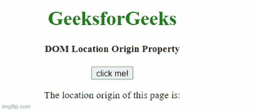
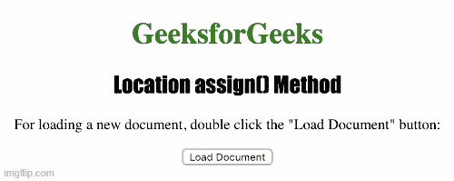

# HTML DOM 定位对象

> 原文:[https://www.geeksforgeeks.org/html-dom-location-object/](https://www.geeksforgeeks.org/html-dom-location-object/)

[HTML DOM](https://www.geeksforgeeks.org/html-dom-html-object/) 中的**位置对象**用于提供网页当前网址的信息。该对象是窗口对象的子部分。因为它通过使用 **window.location** 属性获取信息。位置对象用于检索哈希值、主机名、端口号和协议名称等信息。

下面是下面给出的预定义属性和方法。

**属性:**

*   **hash:** 用于设置或返回 URL 的锚点部分(#)。
*   **主机:**用于设置或返回当前网页 URL 的主机名和端口号。
*   **主机名:**用于设置或返回主机名或网站名称，如“[www.geeksforgeeks.org](www.geeksforgeeks.org)”。
*   **href:** 用于设置或返回网页当前整个 url 的值。
*   **原点:**用于返回一个当前 URL 的协议、主机名和端口号。
*   **路径名:**用于设置或返回网页路径名的值。
*   **端口:**用于设置或返回当前网址的端口号。
*   **协议:**用于设置或返回当前某个 URL 的协议名称。
*   **搜索:**用于设置或返回某个 URL 的查询字符串部分的值。

**方法:**

*   **assign() :** 可用于加载新文档，但这两种方法的区别在于 replace()方法会从文档历史记录中删除当前文档的 URL，因此无法使用“后退”按钮导航回原始文档。
*   **reload():** 用于重载当前文档。
*   **replace():** 用于用新文档替换当前文档。

**注意:**各大浏览器都支持位置对象的所有属性和方法。

下面的例子说明了如何访问位置对象的属性和方法。

**示例 1:** 下面的代码返回 URL 的协议、端口号和主机名。

## 超文本标记语言

```html
<!DOCTYPE html>
<html lang="en">
<body>
    <h1 style="color:green">GeeksforGeeks</h1>
    <b>DOM Location origin property</b>

    <button onclick="getOrigin();">
        Get Location Origin
    </button>

    <p>The location origin of this page is:</p>

    <div class="location"></div>

    <script>
        function getOrigin() {
            let loc = location.origin;
            document.querySelector(
                '.location').innerHTML = loc;
        }
    </script>
</body>
</html>
```

**输出:**



**示例 2:** 下面的代码说明了 **assign()** 方法在定位对象中的使用。

## 超文本标记语言

```html
<!DOCTYPE html>
<html>

<head>
    <title>Location assign() Method in HTML</title>

    <style>
        h1 {
            color:green;
        }

        h2 {
            font-family:Impact;
        }

        body {
            text-align:center;
        }
    </style>
</head>

<body>

    <h1>GeeksforGeeks</h1>
    <h2>Location assign() Method</h2>

    <p>
        For loading a new document, double 
        click the "Load Document" button:
    </p>

    <button ondblclick="load()">
        Load Document
    </button>

    <script>
        function load() {
            location.assign("https://www.geeksforgeeks.org");
        }
    </script>
</body>
</html>

```

**输出:**



**支持的网络浏览器:**

*   谷歌 Chrome
*   微软公司出品的 web 浏览器
*   火狐浏览器
*   歌剧
*   旅行队