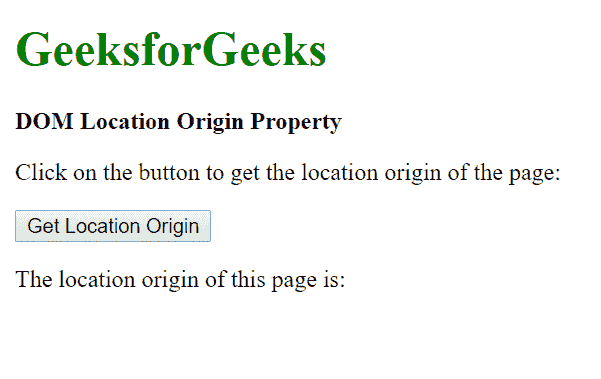
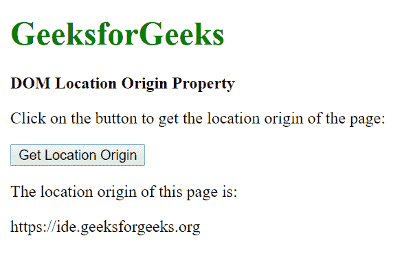

# HTML | DOM 位置原点属性

> 原文:[https://www . geesforgeks . org/html-DOM-location-origin-property/](https://www.geeksforgeeks.org/html-dom-location-origin-property/)

HTML 中的 **DOM 位置原点**属性用于返回一个 URL 的协议、主机名和端口号。这是只读属性。

**语法:**

```html
location.origin
```

**返回值:**该方法返回一个**字符串值**，代表协议、域名(或 IP 地址)和端口号。具有“文件://”协议的 URL 可能会根据浏览器返回不同的值。

**注意:**部分浏览器可能不显示端口号。

以下示例说明了上述方法:

**示例:**

```html
<!DOCTYPE html>
<html lang="en">

<head>
    <title>DOM Location Origin Property</title>
</head>

<body>
    <h1 style="color: green">GeeksforGeeks</h1>
    <b>DOM Location Origin Property</b>
    <p>
      Click on the button to get the location
      origin of the page:
    </p>

    <button onclick="getOrigin();">
        Get Location Origin
    </button>

    <p>The location origin of this page is:</p>

    <div class="location"></div>

    <script>
        function getOrigin() {
            let loc = location.origin;
            document.querySelector('.location')
                .innerHTML = loc;
        }
    </script>
</body>

</html>
```

**输出:**

*   **Before clicking the button:**

    

*   **After clicking the button:**

    

**支持的浏览器:**由 *DOM Location origin* 属性支持的浏览器如下:

*   谷歌 Chrome
*   Internet Explorer 11.0
*   火狐浏览器
*   Opera 15.0
*   旅行队