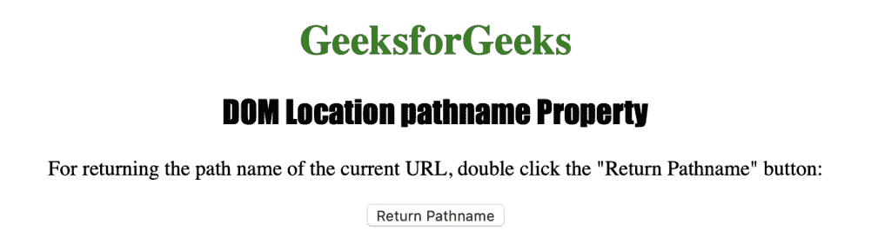
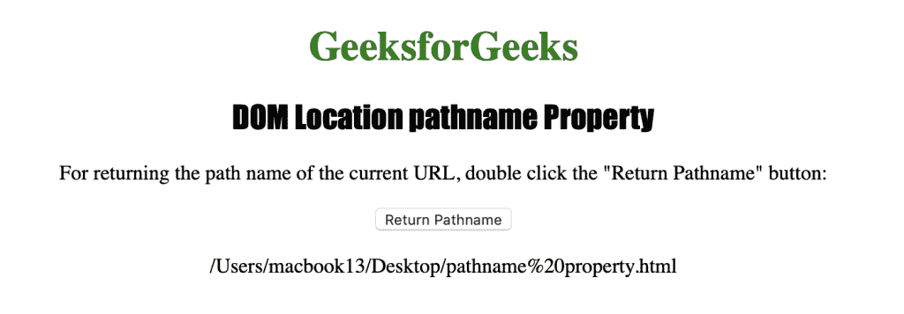

# HTML | DOM 位置路径名属性

> 原文:[https://www . geesforgeks . org/html-DOM-location-pathname-property/](https://www.geeksforgeeks.org/html-dom-location-pathname-property/)

HTML 中的**位置路径名属性**用于设置或返回 URL 的路径名。**位置路径名属性**返回一个代表网址路径名的字符串。

**语法:**

*   它返回路径名属性。

    ```html
    location.pathname
    ```

*   它用于设置 pathname 属性。

    ```html
    location.pathname = path
    ```

下面的程序说明了 HTML 中的位置路径名属性:

**示例:**

## 超文本标记语言

```html
<!DOCTYPE html>
<html>

<head>
    <title>DOM Location pathname Property</title>
    <style>
        h1 {
            color: green;
        }

        h2 {
            font-family: Impact;
        }

        body {
            text-align: center;
        }
    </style>
</head>

<body>
    <h1>GeeksforGeeks</h1>
    <h2>DOM Location pathname Property</h2>
    <p>
       For returning the path name of the 
       current URL, double click the "Return 
       Pathname" button: 
    </p>
    <button ondblclick="mypath()">
      Return Pathname
    </button>
    <p id="path"></p>
    <script>
        function mypath() {
            var p = location.pathname;
            document.getElementById("path").innerHTML = p;
        }
    </script>
</body>

</html>
```

**输出:**

**点击按钮后:**


**支持的浏览器:**位置路径名属性支持的浏览器如下:

*   谷歌 Chrome
*   微软公司出品的 web 浏览器
*   火狐浏览器
*   歌剧
*   旅行队