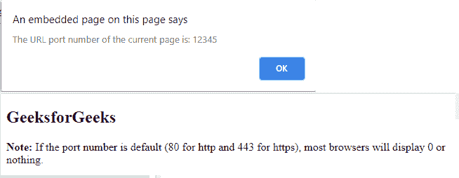

# HTML | DOM 位置端口属性

> 原文:[https://www . geesforgeks . org/html-DOM-location-port-property/](https://www.geeksforgeeks.org/html-dom-location-port-property/)

**HTML DOM 位置端口**属性返回或设置当前网址的端口号。

**语法:**

*   获取端口属性:

    ```html
    location.port
    ```

*   设置端口属性:

    ```html
    location.port = 8080
    ```

**属性值:**

*   A String, to be assigned as port

    **返回值:**

    *   A String, representing the port number of a URL.

    **示例:**

    ```html
    <!DOCTYPE html>
    <html>

    <body>
        <h2>GeeksforGeeks</h2>
        <p id="demo"></p>

        <p><b>Note: </b>If the port number is default 
          (80 for http and 443 for https),
          most browsers will display 0 or nothing.
        </p>

        <script>
            const url = document.createElement('a');
            url.setAttribute('href', 'http://example.com:12345/gfg');

            <!-- accessing "url.port". -->
            window.alert("The URL port number of the current page is: "
                         + url.port);
        </script>
    </body>

    </html>
    ```

    **输出:**
    

    **支持的浏览器:**

    *   谷歌 Chrome
    *   微软公司出品的 web 浏览器
    *   火狐浏览器
    *   歌剧
    *   旅行队