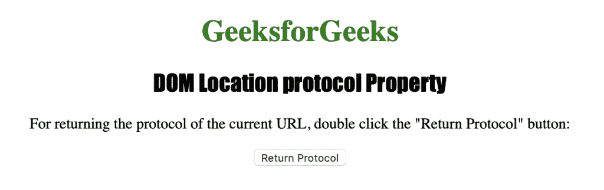
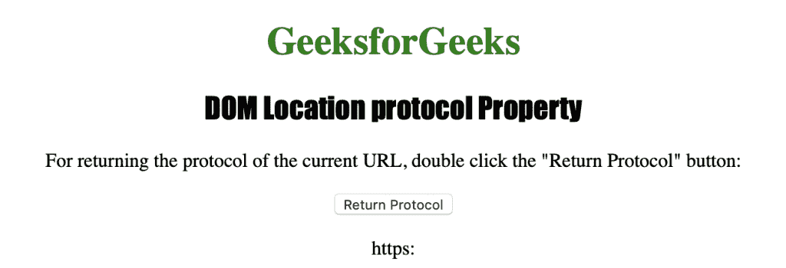

# HTML | DOM 位置协议属性

> 原文:[https://www . geesforgeks . org/html-DOM-location-protocol-property/](https://www.geeksforgeeks.org/html-dom-location-protocol-property/)

HTML 中的**位置协议属性**用于返回协议或设置当前 URL 的协议。它返回一个包含当前网址协议的字符串，包括冒号(:)。
**语法:**

*   它返回协议属性。

```html
location.protocol
```

*   它用于设置协议属性。

```html
location.protocol = protocol
```

**属性值:**该方法接受字符串类型的单值协议。用于设置 URL 的协议。协议的可能值是- file:，ftp:，http:，https:等。
下面的程序用 HTML 说明了 Location 协议属性:
**返回值:**它返回一个字符串值，代表当前 URL 的协议，包括冒号(:)

**例:**

## 超文本标记语言

```html
<!DOCTYPE html>
<html>

<head>
    <title>DOM Location protocol Property</title>
    <style>
        h1 {
            color: green;
        }

        h2 {
            font-family: Impact;
        }

        body {
            text-align: center;
        }
    </style>
</head>

<body>
    <h1>GeeksforGeeks</h1>
    <h2>DOM Location protocol Property</h2>

<p>
      For returning the protocol of the 
      current URL, double click the 
      "Return Protocol" button: 
    </p>

    <button ondblclick="myprotocol()">
      Return Protocol
    </button>
    <p id="pro"></p>

    <script>
        function myprotocol() {
            var p = location.protocol;
            document.getElementById("pro").innerHTML = p;
        }
    </script>
</body>

</html>
```

**输出:**



**双击按钮后:**



**支持的浏览器:**位置协议属性支持的浏览器如下:

*   谷歌 Chrome
*   微软公司出品的 web 浏览器
*   火狐浏览器
*   歌剧
*   旅行队