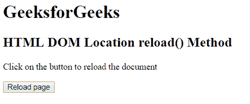

# HTML | DOM 位置重载()方法

> 原文:[https://www . geesforgeks . org/html-DOM-location-reload-method/](https://www.geeksforgeeks.org/html-dom-location-reload-method/)

HTML DOM 中的**位置重载()**方法用于重载当前文档。此方法刷新当前文档。它类似于浏览器中的刷新按钮。

**语法:**

```html
location.reload( forceGet )
```

**参数:**该方法包含单参数 *forceGet* ，可选。该参数包含下列布尔值:

*   **真:**从服务器重新加载当前页面。
*   **假:**从缓存中重新加载当前。

**返回值:**不返回值。

**示例:**

```html
<!DOCTYPE html>
<html>
    <head>
        <title>
            HTML DOM Location reload() Method
        </title>

        <!--script to reload current page-->
        <script>
            function locationreload() {
                location.reload();

        }
        </script>
    </head>

    <body>
        <h1>GeeksforGeeks</h1>

        <h2>
            HTML DOM Location reload() Method
        </h2>

        <p>
            Click on the button to reload the document
        </p>

        <!-- script call here -->
        <button onclick = "locationreload()">
            Reload page
        </button>
    </body>
</html>                    
```

**输出:**
**之前点击按钮:**

**之后点击按钮:**文档会重新加载。

**支持的浏览器:***DOM Location reload()方法*支持的浏览器如下:

*   谷歌 Chrome
*   微软公司出品的 web 浏览器
*   火狐浏览器
*   歌剧
*   旅行队