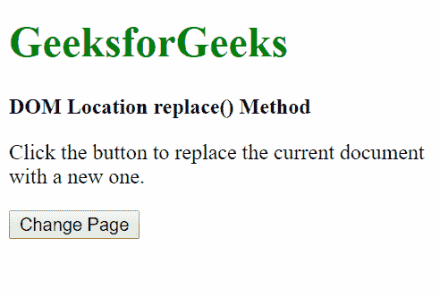

# HTML | DOM 位置替换()方法

> 原文:[https://www . geesforgeks . org/html-DOM-location-replace-method/](https://www.geeksforgeeks.org/html-dom-location-replace-method/)

HTML 中的 DOM **Location replace()** 方法用于将当前文档替换为指定的文档。此方法不同于[分配()](https://www.geeksforgeeks.org/html-location-assign-method/)方法，因为这将从文档历史记录中删除当前文档，因此无法使用“返回”按钮返回到上一个文档。

**语法:**

```html
location.replace( newUrl );
```

**参数:**

*   **newUrl:** 这是当前页面要替换的 Url。这是必需的参数。

**注意:**要替换的 URL 必须允许成帧。

**返回值:**无返回值。

**示例:**

```html
<!DOCTYPE html>
<html lang="en">

<head>
    <title>DOM Location replace() Method</title>
</head>

<body>
    <h1 style="color: green">GeeksforGeeks</h1>
    <b>DOM Location replace() Method</b>

    <p>Click the button to replace 
      the current document with a new one.</p>

    <button onclick="changePage()">
      Change Page
    </button>

    <script>
        function changePage() {

            // change the document to
            // the GeeksforGeeks homepage
            location.replace(
              "https://ide.geeksforgeeks.org");
        }
    </script>
</body>

</html>
```

**注意:**在[ide.geeksforgeeks.org](https://ide.geeksforgeeks.org)上运行上述代码，因为代码中使用的链接是**ide.geeksforgeeks.org**允许取景。

**输出:**

**按下按钮前:**


**按下按钮后:**


**支持的浏览器:***DOM Location replace()*方法支持的浏览器如下:

*   谷歌 Chrome
*   微软公司出品的 web 浏览器
*   火狐浏览器
*   歌剧
*   旅行队