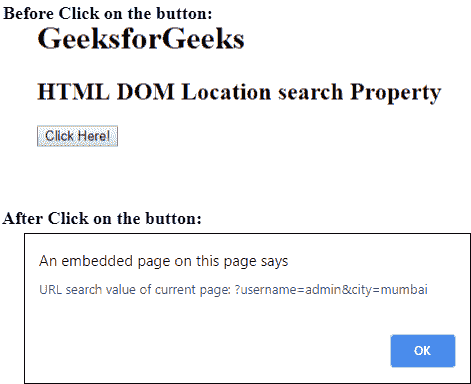

# HTML | DOM 位置搜索属性

> 原文:[https://www . geesforgeks . org/html-DOM-location-search-property/](https://www.geeksforgeeks.org/html-dom-location-search-property/)

HTML DOM 中的**位置搜索属性**用于设置或返回 URL 中包含问号的查询部分。查询部分是问号后的 URL 部分。

**语法:**

*   它返回位置搜索属性。

    ```html
    location.search
    ```

*   它用于设置位置搜索属性。

    ```html
    location.search = searchString
    ```

**属性值:** **搜索字符串**，用于指定网址的搜索部分。

**返回值:**返回一个代表搜索值的字符串。

**示例:**本示例显示 URL 的搜索部分。

```html
<!DOCTYPE html>
<html>

<head>
    <title>
        HTML DOM Location search Property
    </title>
</head>

<body>
    <h1>GeeksforGeeks</h1>

    <h2>
        HTML DOM Location search Property
    </h2>

    <button onclick="myGeeks()">Click Here!</button>

    <!-- script to return location search property -->
    <script>
        function myGeeks() {
            const url = document.createElement('a');

            url.setAttribute('href', 
'https://geeksforgeeks.org/pathname?username=admin&city=mumbai');

            window.alert("URL search value of current page: "
                    + url.search);
        }
    </script>
</body>

</html>                                
```

**输出:**


**支持的浏览器:***DOM 位置搜索属性*支持的浏览器如下:

*   谷歌 Chrome
*   微软公司出品的 web 浏览器
*   火狐浏览器
*   歌剧
*   旅行队