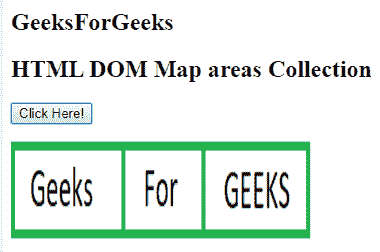
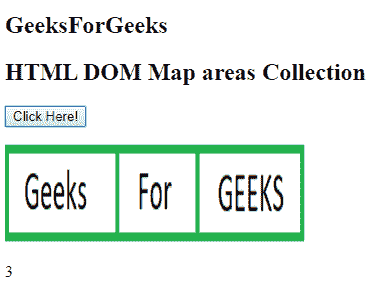

# HTML | DOM 地图区域集合

> 原文:[https://www . geesforgeks . org/html-DOM-map-areas-collection/](https://www.geeksforgeeks.org/html-dom-map-areas-collection/)

HTML DOM 中的**地图区域集合**用于返回图像地图中所有<区域>元素的集合。区域元素在源代码中出现时进行排序。
**语法:**

```html
mapObject.areas
```

**属性:**返回元素集合中的面积数。
**方法:**DOM 地图区域集合包含以下三种方法:

*   **【索引】:**用于返回指定索引的<表单>元素。索引值以 0 开始。如果索引值超出范围，则返回空值。
*   **项(索引):**用于返回指定索引的<表单>元素。索引值以 0 开始。如果索引值超出范围，则返回空值。此方法的执行类似于上述方法。
*   **name item(id):**用于从集合中返回与指定 id 匹配的<表单>元素。如果 id 不存在，则返回空值。

**返回值:**返回一个 HTMLCollection 对象，该对象代表文档中图像映射中的所有<区域>元素。集合中的元素按照它们在源代码中出现的方式进行排序。

**例:**

## 超文本标记语言

```html
<!DOCTYPE html>
<html>

<head>
    <title>
        HTML DOM Map  areas Collection 
    </title>
</head>

<body>
     <h2>
         GeeksForGeeks
     </h2>
    <h2>HTML DOM Map  areas Collection</h2>

    <button onclick = "GFG()">
        Click Here!
    </button>

<p></p>

    <map id = "Geeks" name = "Geeks">

        <area = "rect" coords = "0, 0, 110, 100"
        alt = "Geeks" href =
"https://media.geeksforgeeks.org/wp-content/uploads/a1-21.png">

        <area shape = "rect" coords = "110, 0, 190, 100"
        alt = "For" href =
"https://media.geeksforgeeks.org/wp-content/uploads/a1-22.png">

        <area shape = "rect" coords = "190, 0, 300, 100"
        alt = "GEEKS" href =
"https://media.geeksforgeeks.org/wp-content/uploads/a1-24.png">
    </map>

    

    <p id = "GEEK!"></p>

    <script>
        function GFG() {
            var x = document.getElementById("Geeks").areas.length;
            document.getElementById("GEEK!").innerHTML = x;
        }
    </script>
</body

</html>
```

**输出:**

*   **点击按钮前:**



*   **点击按钮后:**



**支持的浏览器:****HTML DOM 地图区域集合**支持的浏览器如下:

*   谷歌 Chrome
*   微软公司出品的 web 浏览器
*   火狐浏览器
*   苹果 Safari
*   歌剧