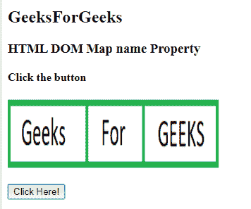
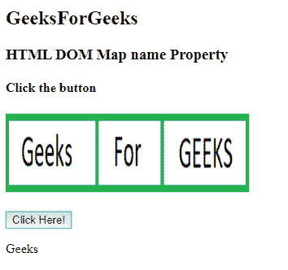
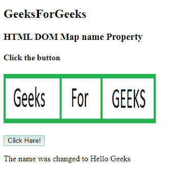

# HTML | DOM 地图名称属性

> 原文:[https://www.geeksforgeeks.org/html-dom-map-name-property/](https://www.geeksforgeeks.org/html-dom-map-name-property/)

HTML DOM 中的**地图名称属性**用于设置或返回地图元素的名称属性值。此属性指定映射图像的名称。该属性与< img > usemap 属性相关联。它在<图像>和<贴图>元素之间创建关系。

**语法:**

*   它返回 name 属性。

    ```html
    mapObject.name
    ```

*   它用于设置 name 属性。

    ```html
    mapObject.name = name
    ```

**属性值:**

*   **名称:**保存图像地图的名称。

**返回值:**返回代表地图元素名称的字符串值。

**示例:**

```html
<!DOCTYPE html> 
<html> 

<head> 
    <title> 
        HTML DOM Map name Property 
    </title> 
</head> 

<body> 
    <h2>
        GeeksForGeeks
    </h2>

    <h3>
        HTML DOM Map name Property 
    </h3>

    <h4>Click the button</h4>

    <map id = "Geeks" name = "Geeks"> 

        <area = "rect" coords = "0, 0, 110, 100"
                alt = "Geeks" href = 
"https://media.geeksforgeeks.org/wp-content/uploads/a1-21.png"> 

        <area shape = "rect" coords = "110, 0, 190, 100"
                alt = "For" href = 
"https://media.geeksforgeeks.org/wp-content/uploads/a1-22.png"> 

        <area shape = "rect" coords = "190, 0, 300, 100"
                alt = "GEEKS" href = 
"https://media.geeksforgeeks.org/wp-content/uploads/a1-24.png"> 
    </map> 

    

    <br><br>

    <button onclick = "GFG()"> 
        Click Here! 
    </button> 

    <p id = "GEEK!"></p> 

    <script> 
        function GFG() { 
            var x = document.getElementById("Geeks").name; 
            document.getElementById("GEEK!").innerHTML = x; 
        } 
    </script> 
</body>

</html>
```

**输出:**

*   **点击按钮前:**
    
*   **点击按钮后:**
    

**例 2:**

```html
<!DOCTYPE html> 
<html> 

<head> 
    <title> 
        HTML DOM Map name Property 
    </title> 
</head> 

<body> 
    <h2>
        GeeksForGeeks
    </h2>

    <h3>
        HTML DOM Map name Property 
    </h3>

    <h4>Click the button</h4> 

    <map id = "Geeks" name = "Geeks"> 

        <area = "rect" coords = "0, 0, 110, 100"
                alt = "Geeks" href = 
"https://media.geeksforgeeks.org/wp-content/uploads/a1-21.png"> 

        <area shape = "rect" coords = "110, 0, 190, 100"
                alt = "For" href = 
"https://media.geeksforgeeks.org/wp-content/uploads/a1-22.png"> 

        <area shape = "rect" coords = "190, 0, 300, 100"
                alt = "GEEKS" href = 
"https://media.geeksforgeeks.org/wp-content/uploads/a1-24.png"> 
    </map>

    

    <br><br>

    <button onclick = "GFG()"> 
        Click Here! 
    </button> 

    <p id = "GEEK!"></p> 

    <script> 
        function GFG() { 
            var x = document.getElementById("Geeks").name
                    = "Hello Geeks"; 

            document.getElementById("GEEK!").innerHTML
                    = "The name was changed to " + x; 
        } 
    </script> 
</body>

</html>
```

**输出:**

*   **点击按钮前:**
    
*   **点击按钮后:**
    

**支持的浏览器:****HTML DOM Map 名称属性**支持的浏览器如下:

*   谷歌 Chrome
*   微软公司出品的 web 浏览器
*   火狐浏览器
*   旅行队
*   歌剧