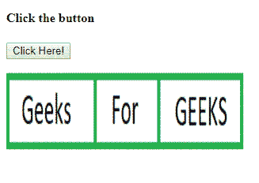

# HTML | DOM 映射对象

> 原文:[https://www.geeksforgeeks.org/html-dom-map-object/](https://www.geeksforgeeks.org/html-dom-map-object/)

HTML DOM 中的地图对象用于创建和访问<map>元素。地图对象创建可点击和可访问的图像部分。
**语法:**</map> 

*   它用于返回地图对象。

```html
var x = document.getElementById("myMap");
```

*   它用于创建地图对象。

```html
var x = document.createElement("MAP");
```

**房产价值:**

*   [**名称:**](https://www.geeksforgeeks.org/html-dom-map-name-property/) 用于设置或返回影像地图名称属性的值。

**收藏价值:**

*   **区域:**用于返回影像地图中所有<区域>元素的集合。
*   **图像:**用于返回与图像地图相关的所有< img >和<对象>元素的集合

**示例 1:** 本示例描述了访问<地图>元素的 getElementById()方法。

## 超文本标记语言

```html
<!DOCTYPE html>
<html>

<head>
    <title>
        HTML DOM Map Object Property
    </title>
</head>

<body>

    <h4>Click the button</h4>

    <button onclick = "GFG()">
        Click Here!
    </button>

<p></p>

    <map id = "Geeks" name = "Geeks">

        <area  = "rect" coords = "0, 0, 110, 100"
        alt = "Geeks" href =
"https://media.geeksforgeeks.org/wp-content/uploads/a1-21.png">

        <area shape = "rect" coords = "110, 0, 190, 100"
        alt = "For" href =
"https://media.geeksforgeeks.org/wp-content/uploads/a1-22.png">

        <area shape = "rect" coords = "190, 0, 300, 100"
        alt = "GEEKS" href =
"https://media.geeksforgeeks.org/wp-content/uploads/a1-24.png">
    </map>

    

    <p id = "GEEK!"></p>

    <script>
        function GFG() {
            var x = document.getElementById("Geeks").areas.length;
            document.getElementById("GEEK!").innerHTML = x;
        }
    </script>
</body

</html>                   
```

**输出:**


**示例 2:** 本示例描述了 document.createElement()方法来创建<地图>元素。

## 超文本标记语言

```html
<!DOCTYPE html>
<html>

<head>
    <title>
        HTML DOM Map Object Property
    </title>
</head>

<body>
    <h4>Click the button</h4>

    <button onclick = "GFG()">
        Click Here!
    </button>

<p></p>

    

    <p id = "GEEK!"></p>

    <!-- script to use map object property -->
    <script>
        function GFG() {
            var x = document.createElement("MAP");
            x.setAttribute("id", "myMap");
            x.setAttribute("name", "myMap");
            document.body.appendChild(x);

            var y = document.createElement("AREA");
            y.setAttribute("href",
"https://media.geeksforgeeks.org/wp-content/uploads/a1-24.png");
            y.setAttribute("shape", "rect");
            y.setAttribute("coords", "190, 0, 300, 100");
            document.getElementById("myMap").appendChild(y);

            document.getElementById("GEEK!").innerHTML =
            "Click on the GEEKS area in the image.";
        }    
    </script>
</body>

</html>                   
```

**输出:**



**支持的浏览器:***DOM Map Object 属性*支持的浏览器如下:

*   谷歌 Chrome 5.0
*   Internet Explorer 8.0
*   Firefox 3.6
*   Safari 5.0
*   歌剧 10.6