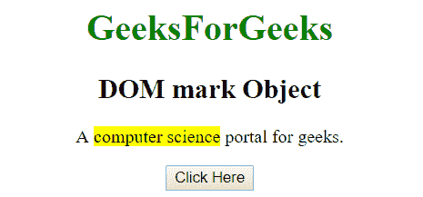
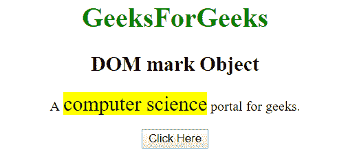
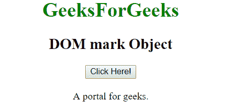
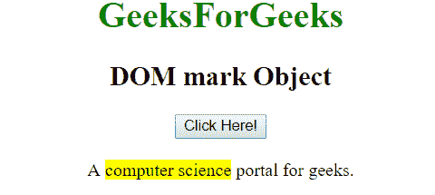

# HTML | DOM 标记对象

> 原文:[https://www.geeksforgeeks.org/html-dom-mark-object/](https://www.geeksforgeeks.org/html-dom-mark-object/)

HTML DOM 中的标记对象用来表示 HTML mark 元素。标记对象在 HTML 5 中是新的。使用 getElementById()方法可以访问<mark>元素。
**语法:**</mark> 

```html
document.getElementById("id")
```

其中 id 被分配给<mark>标签。
**注意:**Internet Explorer 及更早版本不支持此标签。
**例 1:**</mark> 

## 超文本标记语言

```html
<!DOCTYPE html>
<html>
    <head>
        <title>
            HTML DOM Mark Object
        </title>
    </head>

    <body style = "text-align:center;">

        <h1 style = "color:green;" >
            GeeksForGeeks
        </h1>

        <h2>DOM mark Object</h2>

<p>
            A <mark id = "mark_obj">computer science</mark>
            portal for geeks.
        </p>

        <button onclick = "Geeks()">
            Click Here
        </button>

        <script>
            function Geeks() {
                var txt = document.getElementById("mark_obj");
                txt.style.fontSize = "x-large";
            }
        </script>
    </body>
</html>                   
```

**输出:**
**之前点击按钮:**



**点击按钮后:**



**示例 2:** 可以使用 document.createElement 方法创建标记对象。

## 超文本标记语言

```html
<!DOCTYPE html>
<html>
    <head>
        <title>
            HTML DOM Mark Object
        </title>
    </head>

    <body style = "text-align:center;">

        <h1 style = "color:green;" >
            GeeksForGeeks
        </h1>

        <h2>DOM mark Object</h2>

        <button onclick = "Geeks()">
            Click Here!
        </button>

        <br><br>

        <div>
            A <span id = "p"></span>
            portal for geeks.
        </div>

        <script>
            function Geeks() {
                var txt = document.createElement("MARK");
                var t = document.createTextNode("computer science");
                txt.appendChild(t);
                document.getElementById("p").appendChild(txt);
            }
        </script>
</body>
</html>                   
```

**输出:**
**之前点击按钮:**



**点击按钮后:**



**支持的浏览器:**

*   谷歌 Chrome
*   互联网浏览器(IE 9 之后)
*   Mozilla Firefox
*   歌剧
*   旅行队