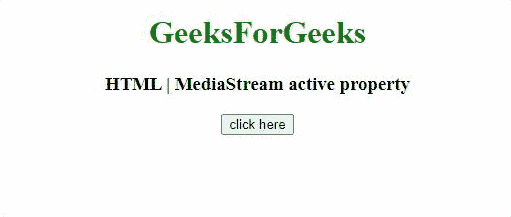

# HTML DOM 媒体流活动属性

> 原文:[https://www . geesforgeks . org/html-DOM-mediastream-active-property/](https://www.geeksforgeeks.org/html-dom-mediastream-active-property/)

**媒体流活动属性**返回 HTML 文档中当前活动流的布尔值。此属性是只读的。如果该流当前是活动的，则它返回**真**否则，它返回**假。**

**语法:**

```html
var isActive = MediaStream.active;
```

**返回值:**该属性返回一个布尔值。

**例 1:** 在本例中，允许音频属性，不允许视频属性。

## 超文本标记语言

```html
<!DOCTYPE HTML>
<html>

<body style="text-align:center;">
    <h1 style="color:green;">
        GeeksForGeeks
    </h1>

    <h3>
        HTML | MediaStream active property
    </h3>

    <button onclick="Geeks()">
        click here
    </button>

    <h2 id="GFG_DOWN"></h2>

    <script>
        function Geeks() {
            var gumStream;
            var el_down = document.getElementById("GFG_DOWN");
            var gumStream = "x";
            navigator.getUserMedia({ audio: true, video: false },
                function (stream) {
                    gumStream = stream;
                    el_down.innerHTML = gumStream.active;
                },
                function (error) {
                    console.log('getUserMedia() error', error);
                });
        }
    </script>
</body>

</html>
```

**输出:**



**例 2:** 在本例中，不允许音频属性，允许视频属性。

## 超文本标记语言

```html
<!DOCTYPE HTML>
<html>

<body style="text-align:center;">
    <h1 style="color:green;">
        GeeksForGeeks
    </h1>

    <h3>
        HTML | MediaStream active property
    </h3>

    <button onclick="Geeks()">
        click here
    </button>

    <h2 id="GFG_DOWN"></h2>

    <script>
        function Geeks() {
            var gumStream;
            var el_down = document.getElementById("GFG_DOWN");
            var gumStream = "x";
            navigator.getUserMedia({ audio: false, video: true },
                function (stream) {
                    gumStream = stream;
                    el_down.innerHTML = gumStream.active;
                },
                function (error) {
                    console.log('getUserMedia() error', error);
                });
        }
    </script>
</body>

</html>
```

**输出:**


**示例 3:** 在该示例中，音频属性和视频属性都是允许的。

## 超文本标记语言

```html
<!DOCTYPE HTML> 
<html> 

<body style="text-align:center;"> 
    <h1 style="color:green;"> 
        GeeksForGeeks 
    </h1> 
    <h3> 
        HTML | MediaStream active property
    </h3> 

    <button onclick="Geeks()"> 
        click here 
    </button> 

    <h2 id="GFG_DOWN"></h2> 

    <script> 
    function Geeks() { 
        var gumStream;
        var el_down = document.getElementById("GFG_DOWN"); 
        var gumStream = "x";
        navigator.getUserMedia({audio: true, video: true},
            function(stream) {
                 gumStream = stream;
                 el_down.innerHTML = gumStream.active;
            },
            function(error) {
                console.log('getUserMedia() error', error);
            });
    }
    </script> 
</body> 

</html>
```

**输出:**


**支持的浏览器:**

*   谷歌 Chrome
*   边缘
*   火狐浏览器
*   旅行队