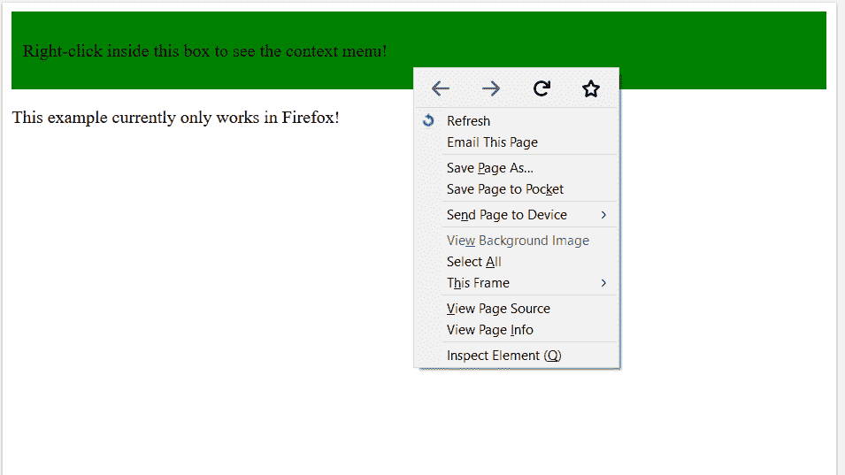

# HTML | DOM 菜单对象

> 原文:[https://www.geeksforgeeks.org/html-dom-menu-object/](https://www.geeksforgeeks.org/html-dom-menu-object/)

DOM 菜单对象用于*表示一个 HTML strong <菜单> 元素*。这个标签定义了一个命令列表。它用于上下文菜单、工具栏以及列出表单控件和命令。

**语法:**

*   **访问菜单对象**

    ```html
    var y = document.getElementById("myMenu");
    ```

*   **创建菜单对象**

    ```html
    var y = document.createElement("MENU");
    ```

**属性:**

*   **标签:**设置或返回菜单的标签属性值。
*   **类型:**设置或返回菜单的类型属性值。

**示例-1:** 访问菜单对象。

```html
<!DOCTYPE html>
<html>

<body>

    <div style="background:green;
                padding: 10px;"
         contextmenu="MENU">
        <p>Right-click inside the box 
          to see the context menu!!!</p>

        <menu type="context" 
              id="MENU">
            <menuitem label="Refresh" 
                      onclick="window.location.reload();"
                      icon="ico_reload.png">
          </menuitem>

            <menuitem label="Email This Page" 
                      onclick="window.location=
                         'mailto:?body='
                               +window.location.href;">
          </menuitem>
        </menu>

    </div>
    <script>
        function Geeks() {
            var y = document.getElementById("MENU");

        }
    </script>

    <p>This example can work only on Firefox!</p>

</body>

</html>
```

**输出:**


**示例-2:** 创建菜单对象。

```html
<!DOCTYPE html>
<html>

<body>

    <div style="background:pink;
                padding: 10px;"
         contextmenu="MENU">
        <p>Right-click inside the box 
          to see the context menu!!!</p>

        <menu type="context"
              id="MENU">
            <menuitem label="Refresh"
                      onclick="window.location.reload();"
                      icon="ico_reload.png">
          </menuitem>

            <menuitem label="Email This Page"
                      onclick="window.location=
                               'mailto:?body='
                               +window.location.href;">
          </menuitem>
        </menu>

    </div>
    <script>
        function Geeks() {

           //creating menu
            var y = 
                document.createElement("MENU"); 

            document.getElementById("MENU");
        }
    </script>

    <p>This example can work only on Firefox!</p>

</body>

</html>
```

**输出:**


**支持的浏览器:**

*   Mozilla Firefox-8.0