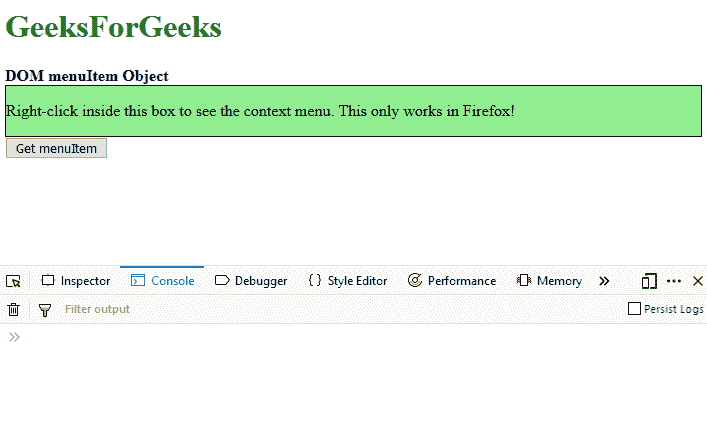
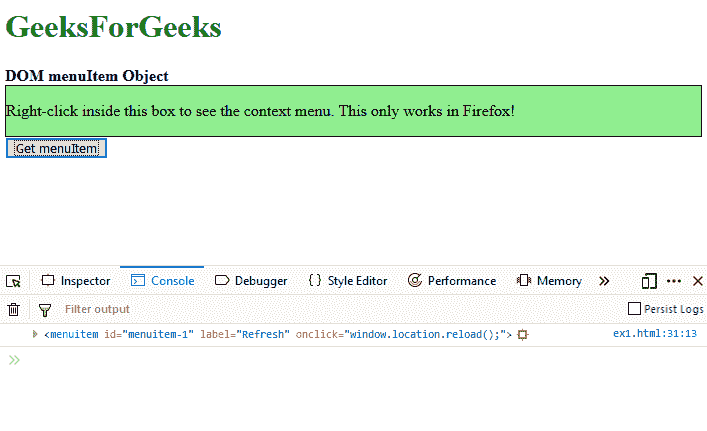
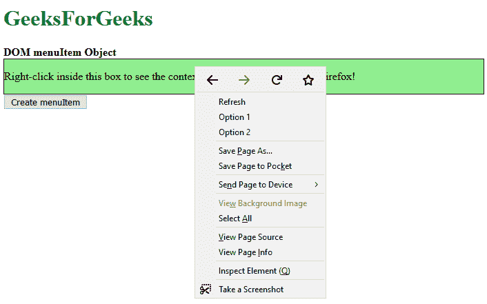
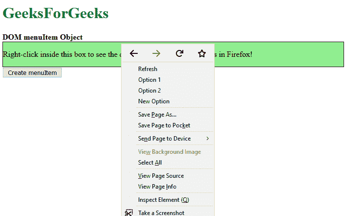

# HTML | DOM MenuItem Object

> 哎哎哎:# t0]https://www . geeksforgeeks . org/html-DOM-menu item-object/

**DOM 菜单项对象**用于表示一个 HTML strong <菜单项> 元素。这个标签定义了上下文菜单中每个菜单项的内容和动作。这也可以配置为某些类型的输入，如复选框和单选按钮。

**语法:**

*   **访问菜单对象**

    ```html
    var item = document.getElementById("menuItem");
    ```

*   **创建菜单对象**

    ```html
    var item = document.createElement("MENUITEM");
    ```

**属性:**

*   **图标:**该属性设置或返回可用于表示菜单项的图像。
*   **标签:**该属性设置或返回菜单项标签的值。标签是向用户显示的文本。
*   **类型:**该属性设置或返回菜单项类型的值。这允许将菜单项更改为复选框或单选按钮。
*   **选中:**该属性设置或返回是否默认选中菜单项。
*   **命令:**该属性设置或返回菜单项的命令属性值。
*   **禁用:**该属性设置或返回的是默认情况下应禁用的菜单项，使其不可选择。
*   **radiogroup:** 该属性设置或返回菜单项 radiogroup 的值。这用于区分单选按钮组。
*   **默认:**该属性设置或返回的是菜单项应有的默认命令。这可用于提交表单。

**示例-1:** 访问菜单项对象。

```html
<!DOCTYPE html>
<html>

<head>
    <title>
      DOM menuItem Object
  </title>
    <style>
        .output {
            border: 1px solid;
            background-color: lightgreen;
        }
    </style>
</head>

<body>
    <h1 style="color: green">
      GeeksForGeeks
  </h1>
    <b>DOM menuItem Object</b>
    <div class="output" 
         contextmenu="menu1">
        <p>Right-click inside this box to
          see the context menu. This only 
          works in Firefox!
      </p>
        <menu type="context" 
              id="menu1">
            <menuitem id="menuitem-1" 
                      label="Refresh"
                      onclick=
                "window.location.reload();">
            </menuitem>

            <menuitem id="menuitem-2" 
                      label="Option 1" 
                      type="checkbox" >
            </menuitem>

            <menuitem id="menuitem-3 " 
                      label="Option 2 " 
                      type="checkbox">
            </menuitem>

        </menu>
    </div>
    <button onclick="getMenuItem()">
      Get menuItem
  </button>
    <script>
        function getMenuItem() {
            var item = 
                document.getElementById('menuitem-1');
            console.log(item);
        }
    </script>
</body>

</html>
```

**输出:**
**点击按钮前:**


**点击按钮后:**


**示例-2:** 创建菜单项对象。

```html
<!DOCTYPE html>
<html>

<head>
    <title>
      DOM menuItem Object
  </title>
    <style>
        .output {
            border: 1px solid;
            background-color: 
              lightgreen;
        }
    </style>
</head>

<body>
    <h1 style="color: green">
      GeeksForGeeks
  </h1>
    <b>DOM menuItem Object</b>
    <div class="output" 
         contextmenu="menu1">

        <p>
          Right-click inside this
          box to see the context menu.
          This only works in Firefox!
      </p>
        <menu type="context" 
              id="menu1">
            <menuitem id="menuitem-1"
                      label="Refresh" 
                      onclick=
                 "window.location.reload();">
            </menuitem>

            <menuitem id="menuitem-2"
                      label="Option 1" 
                      type="checkbox">
          </menuitem>
            <menuitem id="menuitem-3" 
                      label="Option 2" 
                      type="checkbox">
          </menuitem>
        </menu>
    </div>
    <button onclick="createMenuItem()">
      Create menuItem
  </button>
    <script>
        function createMenuItem() {
            var item = 
                document.createElement(
                  "MENUITEM");

            item.label = "New Option";
            document.querySelector(
              '#menu1').appendChild(item);
        }
    </script>
</body>

</html>
```

**输出:**
**点击按钮前:**


**点击按钮后:**


**支持的浏览器:**

*   Mozilla Firefox