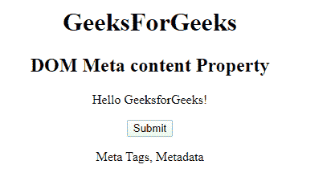
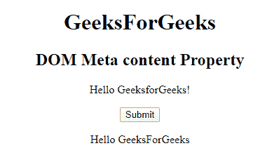

# HTML | DOM 元内容属性

> 原文:[https://www . geesforgeks . org/html-DOM-meta-content-property/](https://www.geeksforgeeks.org/html-dom-meta-content-property/)

HTML DOM 中的**元内容属性**用于设置或返回<元>元素的内容属性值。内容属性用于指定元信息的内容。

**语法:**

*   用于返回内容属性:

    ```html
    metaObject.content 
    ```

*   用于设置内容属性:

    ```html
    metaObject.content = text
    ```

**属性值:**包含定义元信息内容的值，即**文本**。

**返回值:**返回一个字符串值，代表元元素的内容属性值。

**示例:**

```html
<!DOCTYPE html> 
<html> 

<head> 
    <meta name="keywords"
        content="Meta Tags, Metadata" /> 
</head> 

<body> 
    <center> 
        <h1>GeeksForGeeks</h1> 
        <h2>DOM Meta content Property</h2> 
        <p>Hello GeeksforGeeks!</p> 

        <button onclick="myGeeks()"> 
        Submit</button> 

        <p id="sudo"></p> 

        <script> 
            function myGeeks() { 
                var x = 
                document.getElementsByTagName( 
                "META")[0].content; 

                document.getElementById( 
                "sudo").innerHTML = x; 
            } 
        </script> 
</center> 
</body> 

</html>             
```

**输出:**
**点击按钮前:**

**点击按钮后:**


**例 2:**

```html
<!DOCTYPE html> 
<html> 

<head> 
    <meta name="keywords"
        content="Meta Tags, Metadata" /> 
</head> 

<body> 
    <center> 
        <h1>GeeksForGeeks</h1> 
        <h2>DOM Meta content Property</h2> 
        <p>Hello GeeksforGeeks!</p> 

        <button onclick="myGeeks()"> 
        Submit</button> 

        <p id="sudo"></p> 

        <script> 
            function myGeeks() { 
                var x = 
                document.getElementsByTagName( 
                "META")[0].content = "Hello GeeksForGeeks"
                ; 

                document.getElementById( 
                "sudo").innerHTML = x; 
            } 
        </script> 
</center> 
</body> 

</html>
```

**输出:**
**点击按钮前:**

**点击按钮后:**


**支持的浏览器:****DOM 元内容属性**支持的浏览器如下:

*   谷歌 Chrome
*   微软公司出品的 web 浏览器
*   火狐浏览器
*   苹果 Safari
*   歌剧