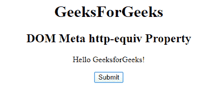
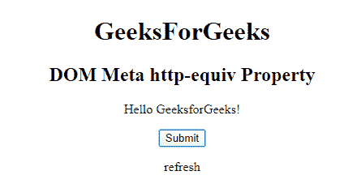

# HTML | DOM Meta httpquiv 属性

> 原文:[https://www . geesforgeks . org/html-DOM-meta-httpequiv-property/](https://www.geeksforgeeks.org/html-dom-meta-httpequiv-property/)

**HTML DOM Meta HTTP quiv 属性**用于为内容属性中的信息设置或返回一个 HTTP 头。属性用于提供标题信息或内容属性的值。它可以用来模拟一个 HTTP 头响应。

**语法:**

*   **返回属性:**

    ```html
    metaObject.httpEquiv 
    ```

*   用于设置 httpEquiv 属性:

    ```html
    metaObject.httpEquiv = HTTP-he 
    ```

**属性值:**

*   **内容类型**指定文档内容的字符集。
*   **默认样式**它指定了要使用的首选样式表。
*   **刷新**定义文档自身刷新的时间间隔。

**示例:**

```html
<!DOCTYPE html> 
<html> 

<head> 
  <meta http-equiv="refresh" content="30">

</head> 

<body> 
    <center> 
        <h1>GeeksForGeeks</h1> 
        <h2>DOM Meta http-equiv  Property</h2> 
        <p>Hello GeeksforGeeks!</p> 

        <button onclick="myGeeks()"> 
        Submit</button> 

        <p id="sudo"></p> 

        <script> 
            function myGeeks() { 
                var x = 
                document.getElementsByTagName( 
                "META")[0].httpEquiv; 

                document.getElementById( 
                "sudo").innerHTML = x; 
            } 
        </script> 
</center> 
</body> 

</html> 
```

**输出:**
**点击按钮前:**

**点击按钮后:**


**支持的浏览器:**T2 DOM Meta httpquiv 属性支持的浏览器如下:

*   谷歌 Chrome
*   微软公司出品的 web 浏览器
*   火狐浏览器
*   苹果 Safari
*   歌剧