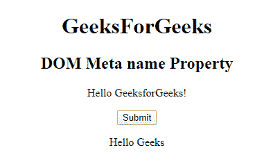

# HTML | DOM 元名称属性

> 原文:[https://www.geeksforgeeks.org/html-dom-meta-name-property/](https://www.geeksforgeeks.org/html-dom-meta-name-property/)

**HTML DOM 元名称属性**用于返回或设置名称的名称，当用户提交表单数据时，用于引用表单数据。它还引用了 javascript 中的元素。

**语法:**

*   它用于返回 name 属性。

    ```html
    metaObject.name
    ```

*   它用于设置 name 属性。

    ```html
    metaObject.name = name
    ```

**属性值:**

*   **名称:**指定元元素的名称。

**返回值:**返回一个代表元元素名称的字符串值。

**例 1:** 这个程序说明了如何返回 Property 这个名字。

```html
<!DOCTYPE html> 
<html> 

<head> 
    <meta name="keywords"
        content="Meta Tags, Metadata"  /> 
</head> 

<body> 
    <center> 
        <h1>GeeksForGeeks</h1> 
        <h2>DOM Meta name Property</h2> 
        <p>Hello GeeksforGeeks!</p> 

        <button onclick="myGeeks()"> 
        Submit</button> 

        <p id="sudo"></p> 

        <script> 
            function myGeeks() { 
                var x = 
                document.getElementsByTagName( 
                "META")[0].name;
                ; 

                document.getElementById( 
                "sudo").innerHTML = x; 
            } 
        </script> 
</center> 
</body> 

</html>
```

**输出:**
**点击按钮前:**

**点击按钮后:**


**示例-2:** 该程序说明了如何设置名称属性。

```html
<!DOCTYPE html> 
<html> 

<head> 
    <meta name="keywords"
        content="Meta Tags, Metadata"  /> 
</head> 

<body> 
    <center> 
        <h1>GeeksForGeeks</h1> 
        <h2>DOM Meta name Property</h2> 
        <p>Hello GeeksforGeeks!</p> 

        <button onclick="myGeeks()"> 
        Submit</button> 

        <p id="sudo"></p> 

        <script> 
            function myGeeks() { 
                var x = 
                document.getElementsByTagName( 
                "META")[0].name = "Hello Geeks";
                ; 

                document.getElementById( 
                "sudo").innerHTML = x; 
            } 
        </script> 
</center> 
</body> 

</html>
```

**输出:**
**点击按钮前:**

**点击按钮后:**


**支持的浏览器:****DOM 元名称属性**支持的浏览器如下:

*   谷歌 Chrome
*   微软公司出品的 web 浏览器
*   火狐浏览器
*   苹果 Safari
*   歌剧